# Data Flow Architecture

## Overview

This document describes how data flows through the Excel Data Merge Tool, from file upload through matching, merging, and output generation.

## High-Level Data Flow

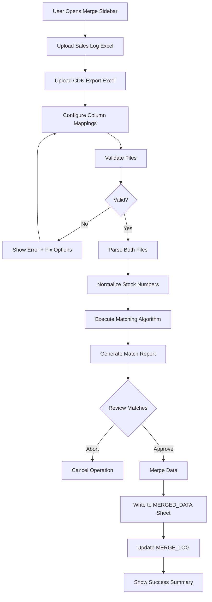

## Detailed Processing Pipeline

```mermaid
graph LR
    subgraph Input Stage
        A1[Sales Log Upload]
        A2[CDK Export Upload]
    end
    
    subgraph Processing Stage
        B1[File Validation]
        B2[Excel Parsing]
        B3[Data Extraction]
        B4[Normalization]
    end
    
    subgraph Matching Stage
        C1[Stock Number Normalization]
        C2[Exact Match]
        C3[Fuzzy Match]
        C4[Manual Review Queue]
    end
    
    subgraph Merge Stage
        D1[Combine Matched Data]
        D2[Flag Unmatched Records]
        D3[Calculate Summary Stats]
    end
    
    subgraph Output Stage
        E1[Generate MERGED_DATA Sheet]
        E2[Create Match Report]
        E3[Update MERGE_LOG]
        E4[User Notification]
    end
    
    A1 --> B1
    A2 --> B1
    B1 --> B2
    B2 --> B3
    B3 --> B4
    B4 --> C1
    C1 --> C2
    C2 --> C3
    C3 --> C4
    C4 --> D1
    D1 --> D2
    D2 --> D3
    D3 --> E1
    E1 --> E2
    E2 --> E3
    E3 --> E4
```

## File Upload Flow

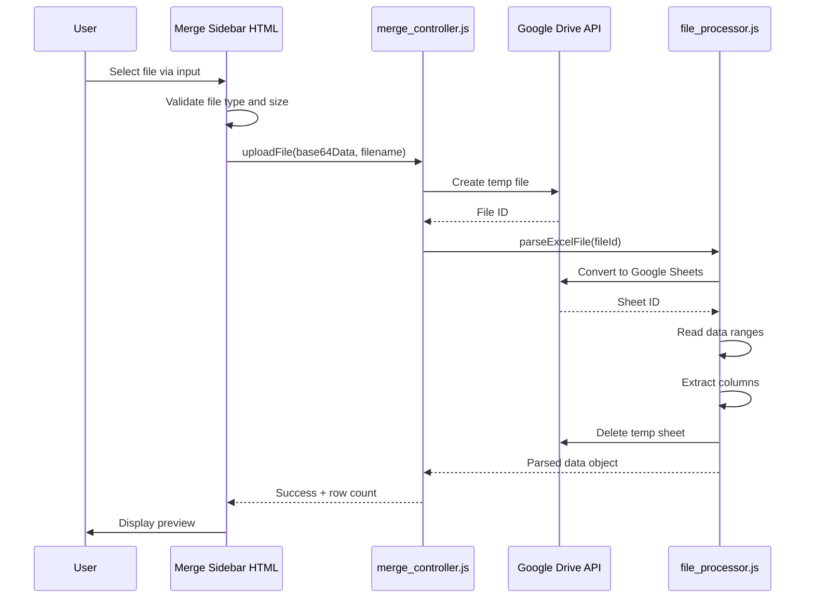

## Stock Number Matching Flow

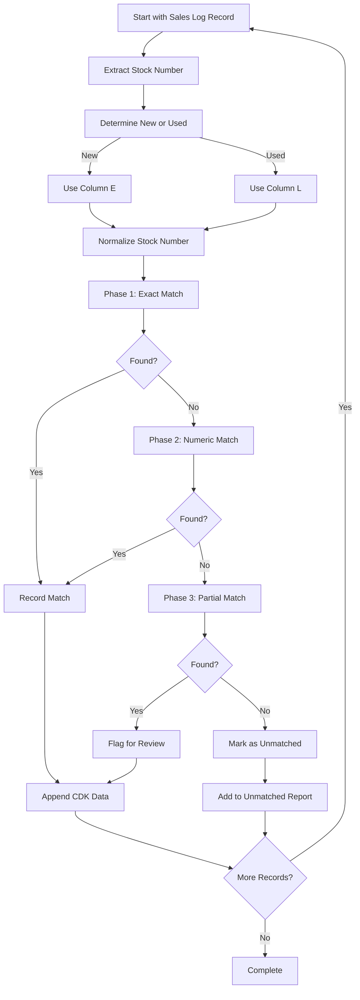

## Data Transformation Pipeline

### Phase 1: Input Processing

```
Sales Log Excel File                    CDK Export Excel File
        ↓                                       ↓
┌───────────────────┐              ┌────────────────────────┐
│ File Upload       │              │ File Upload            │
│ • Validate format │              │ • Validate format      │
│ • Check size      │              │ • Check size           │
│ • Create temp file│              │ • Create temp file     │
└────────┬──────────┘              └───────────┬────────────┘
         ↓                                     ↓
┌───────────────────┐              ┌────────────────────────┐
│ Parse Excel       │              │ Parse Excel            │
│ • Convert to      │              │ • Convert to           │
│   Sheets format   │              │   Sheets format        │
│ • Extract data    │              │ • Extract data         │
│ • Validate columns│              │ • Validate columns     │
└────────┬──────────┘              └───────────┬────────────┘
         ↓                                     ↓
┌───────────────────┐              ┌────────────────────────┐
│ Extract Key Data  │              │ Extract Key Data       │
│ Col E: New Stock  │              │ Col D: Stock No.       │
│ Col L: Used Stock │              │ Col J: Stock Type      │
│ Col B: Customer   │              │ Col K: Front GP$       │
│ Col C: Model      │              │ Col L: Back GP$        │
└────────┬──────────┘              └───────────┬────────────┘
         ↓                                     ↓
         └──────────────┬────────────────────┘
                        ↓
                 To Phase 2
```

### Phase 2: Normalization & Matching

```
Sales Log Data                      CDK Export Data
     ↓                                    ↓
┌─────────────────┐               ┌──────────────────┐
│ Normalize Stocks│               │ Normalize Stocks │
│ • Uppercase     │               │ • Uppercase      │
│ • Trim spaces   │               │ • Trim spaces    │
│ • Remove zeros  │               │ • Remove zeros   │
│ • Extract nums  │               │ • Extract nums   │
└────────┬────────┘               └────────┬─────────┘
         ↓                                 ↓
         └────────────┬────────────────────┘
                      ↓
            ┌─────────────────┐
            │ Build Index     │
            │ Map: normalized │
            │   stock → CDK   │
            │   record        │
            └────────┬────────┘
                     ↓
            ┌─────────────────┐
            │ Match Each Sales│
            │ Log Record      │
            │ • Try exact     │
            │ • Try numeric   │
            │ • Try partial   │
            └────────┬────────┘
                     ↓
              To Phase 3
```

### Phase 3: Merging & Output

```
Matched Pairs                    Unmatched Records
     ↓                                  ↓
┌─────────────────┐            ┌──────────────────┐
│ Merge CDK Data  │            │ Flag for Review  │
│ into Sales Log  │            │ • List stock #   │
│ • Append GP$    │            │ • Suggest fixes  │
│ • Mark matched  │            │ • Allow manual   │
└────────┬────────┘            └────────┬─────────┘
         ↓                              ↓
         └───────────┬──────────────────┘
                     ↓
          ┌──────────────────┐
          │ Generate Output  │
          │ • All Sales Log  │
          │   columns        │
          │ • + CDK GP cols  │
          │ • + Match status │
          └────────┬─────────┘
                   ↓
          ┌──────────────────┐
          │ Write to Sheet   │
          │ MERGED_DATA      │
          │ • Clear existing │
          │ • Write headers  │
          │ • Write data     │
          │ • Apply format   │
          └────────┬─────────┘
                   ↓
          ┌──────────────────┐
          │ Create Reports   │
          │ • Match stats    │
          │ • Unmatched list │
          │ • Audit log      │
          └────────┬─────────┘
                   ↓
          ┌──────────────────┐
          │ User Notification│
          │ • Success dialog │
          │ • Show summary   │
          │ • Link to output │
          └──────────────────┘
```

## Data Structure Flow

### Input Data Structures

#### Sales Log Record (from MONTHLY sheet)
```javascript
{
  customerLastName: "Smith",      // Column B
  model: "CORV",                  // Column C
  stockNumberNew: "T5102344",     // Column E (if new)
  stockNumberUsed: "K5114426",    // Column L (if used)
  tradeStockNo: "ABC123",         // Column F or M
  salesperson: "JOHNSON,DAVID"    // Column G or N
}
```

#### CDK Export Record
```javascript
{
  contractDate: "2025-09-26",     // Column A
  customer: "Cain, Cornel",       // Column B
  vin: "1G1YB3D49T5102344",       // Column C
  stockNo: "T5102344",            // Column D
  status: "F",                    // Column E
  plc: "P",                       // Column F
  saleType: "Retail",             // Column G
  year: 2026,                     // Column H
  model: "CORV",                  // Column I
  stockType: "NEW",               // Column J (determines E or L in Sales Log)
  frontGP: 4689.00,               // Column K
  backGP: 411.00,                 // Column L
  totalGP: 5100.00,               // Column M
  cashPrice: 107085.00,           // Column N
  trades: "",                     // Column O
  serviceContract: "",            // Column P
  financeInstitution: "CASH",     // Column Q
  salesperson: "6587 - JOHNSON,DAVID", // Column R
  fiManager: "6471 - GERTS,ERIC", // Column S
  term: "Cash",                   // Column T
  dealNo: 73154                   // Column U
}
```

### Intermediate Data Structures

#### Normalized Stock Number Map
```javascript
{
  "T5102344": {
    original: "T5102344",
    normalized: "T5102344",
    numericOnly: "5102344",
    cdkRecord: { /* full CDK record */ },
    matchType: "exact"
  },
  "5102344": {
    // Secondary index for numeric matching
    original: "T5102344",
    normalized: "T5102344",
    numericOnly: "5102344",
    cdkRecord: { /* same CDK record */ },
    matchType: "numeric"
  }
}
```

#### Match Result
```javascript
{
  salesLogRecord: { /* original sales log record */ },
  cdkMatch: { /* matched CDK record */ } || null,
  matchType: "exact" | "numeric" | "partial" | "unmatched",
  confidence: 1.0,  // 0.0 - 1.0
  stockNumber: "T5102344",
  isNew: true,
  grossProfitData: {
    frontGP: 4689.00,
    backGP: 411.00,
    totalGP: 5100.00
  }
}
```

### Output Data Structure

#### Merged Record (MERGED_DATA sheet row)
```javascript
[
  // Original Sales Log columns (A-N from MONTHLY)
  1,                          // A: Row number
  "Smith",                    // B: Customer
  "CORV",                     // C: Model
  "C",                        // D: FI flag (New)
  "T5102344",                 // E: Stock # (New)
  "NT",                       // F: Trade Stk #
  "JOHNSON,DAVID",            // G: Salesperson
  "",                         // H: (blank)
  "",                         // I: (blank)
  "",                         // J: FI flag (Used)
  "",                         // K: (blank)
  "",                         // L: Stock # (Used)
  "",                         // M: Trade Stk #
  "",                         // N: Salesperson
  
  // Appended CDK Data (O-T)
  4689.00,                    // O: Front GP$
  411.00,                     // P: Back GP$
  5100.00,                    // Q: Total GP$
  "exact",                    // R: Match Type
  "T5102344",                 // S: Matched Stock #
  "2025-09-26"                // T: CDK Contract Date
]
```

## Processing Flows

### Flow 1: File Upload and Validation

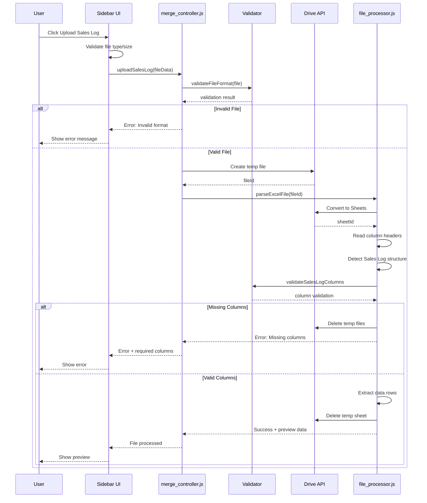

### Flow 2: Stock Number Matching Process

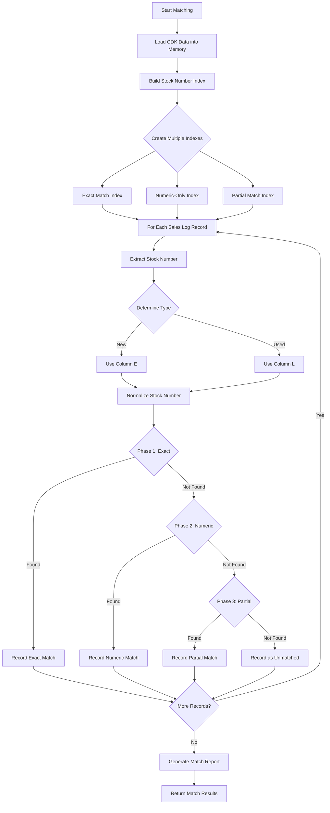

### Flow 3: Data Merge and Output

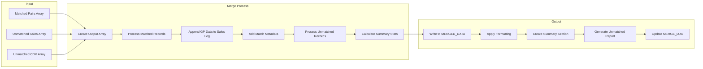

## State Management Flow

### Processing State Transitions

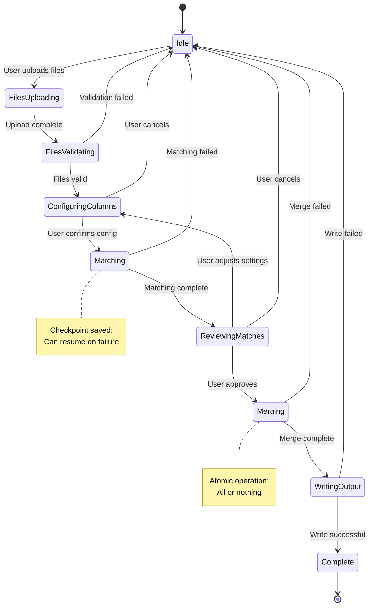

### Checkpoint and Recovery Flow

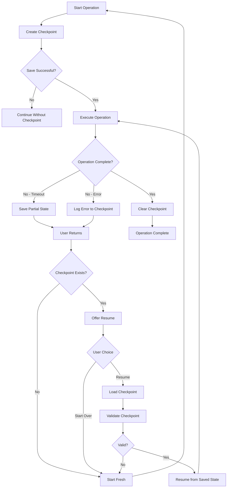

## Data Volume Considerations

### Expected Data Volumes

Based on sample [`september.xlsx`](../september.xlsx):

```
Sales Log MONTHLY Sheet:
- Typical monthly records: 250 deals
- Columns: 14 (A-N)
- Total cells: ~3,500
- File size: ~100KB

CDK Export:
- Typical monthly records: 250 deals
- Columns: 21 (A-U)
- Total cells: ~5,250
- File size: ~150KB

Merged Output:
- Records: 250
- Columns: 20 (A-T)
- Total cells: ~5,000
- File size: ~120KB
```

### Scaling Strategy

**Current Design (Phase 1)**:
- Target: Up to 1,000 records per merge
- Method: In-memory processing
- Time: <2 minutes

**If Needed (Phase 2)**:
- Target: 1,000-5,000 records
- Method: Chunked processing with checkpoints
- Time: 2-5 minutes

**Maximum Capacity**:
- Hard limit: 5,000 records (Apps Script timeout)
- Beyond this: Requires Cloud Functions migration

## Caching Strategy

### Cache Hierarchy

```
Level 1: Script Cache (10 min TTL)
├─ Parsed file data during session
├─ Stock number indexes
└─ Match results

Level 2: Properties Service (Permanent)
├─ Column mapping configuration
├─ Matching rules configuration
└─ Recent merge metadata

Level 3: Sheet Storage (Permanent)
├─ MERGED_DATA (final output)
└─ MERGE_LOG (audit trail)
```

### Cache Invalidation

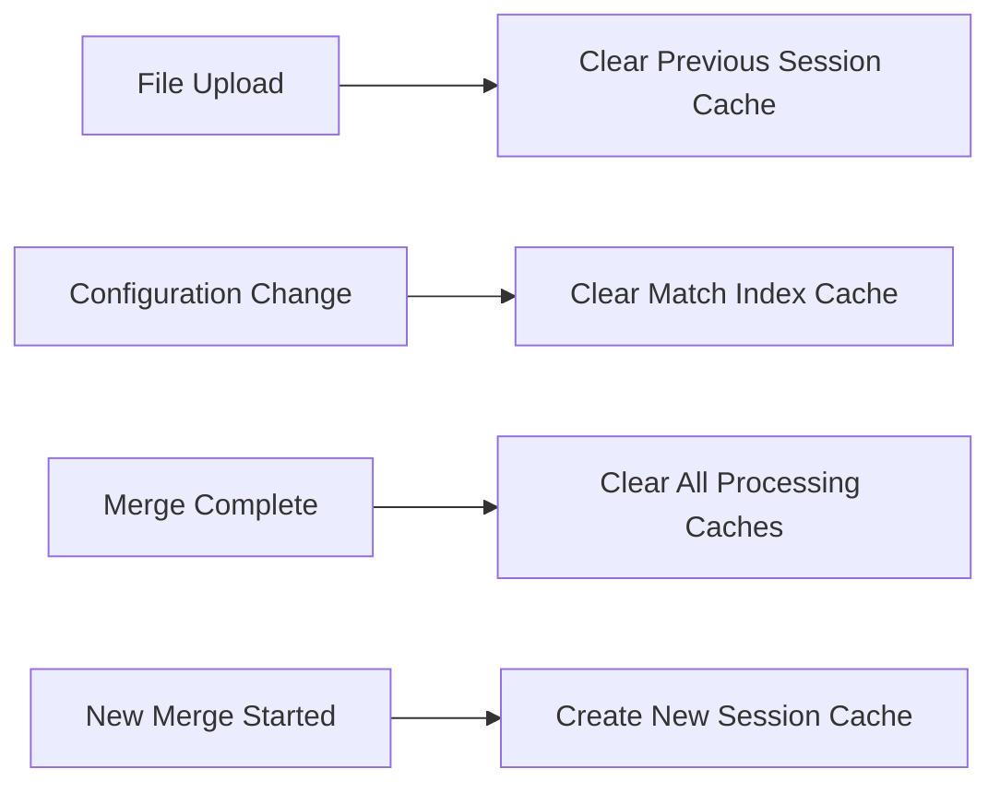

## Error Flow

### Error Propagation Pattern

```
User Action (Sidebar)
        ↓
┌───────────────────────┐
│ Client Validation     │ → Show inline errors
│ • File type           │
│ • File size           │
│ • Required fields     │
└───────────┬───────────┘
            ↓
┌───────────────────────┐
│ Server Validation     │ → Return error object
│ • File format         │
│ • Column structure    │
│ • Data integrity      │
└───────────┬───────────┘
            ↓
┌───────────────────────┐
│ Processing            │ → Log + checkpoint
│ • Parsing errors      │
│ • Matching errors     │
│ • Merge errors        │
└───────────┬───────────┘
            ↓
┌───────────────────────┐
│ Error Handler         │
│ • Classify error      │
│ • Determine recovery  │
│ • Log to MERGE_LOG    │
└───────────┬───────────┘
            ↓
┌───────────────────────┐
│ User Notification     │
│ • Friendly message    │
│ • Suggested action    │
│ • Error details       │
└───────────────────────┘
```

## Batch Processing Flow

For handling large datasets efficiently:

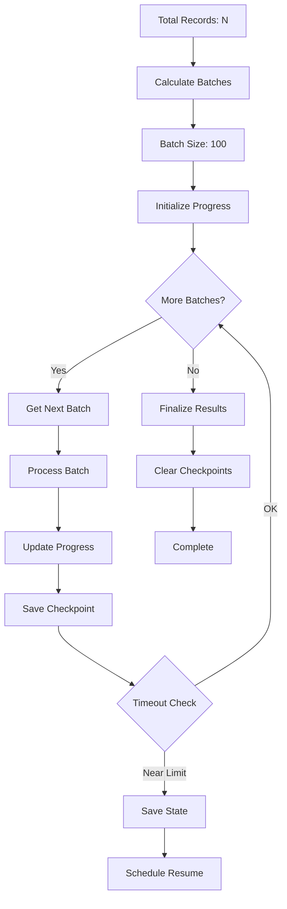

**Progress Calculation**:
```javascript
const progress = {
  total: totalRecords,
  processed: processedCount,
  matched: matchedCount,
  unmatched: unmatchedCount,
  percentage: Math.round((processedCount / totalRecords) * 100),
  timeElapsed: Date.now() - startTime,
  estimatedTimeRemaining: calculateETA(processedCount, totalRecords, startTime)
};
```

## Integration Data Flow

### Interaction with Sales Log Pro

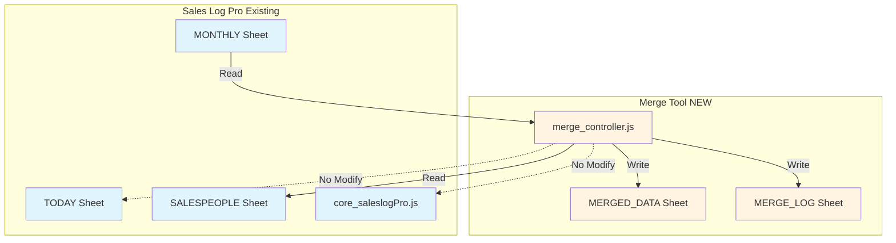

**Key Principles**:
- ✅ Read from MONTHLY sheet (source data)
- ✅ Read from SALESPEOPLE sheet (reference)
- ✅ Write to new MERGED_DATA sheet (output)
- ✅ Write to MERGE_LOG sheet (audit)
- ❌ Never modify TODAY sheet
- ❌ Never modify MONTHLY sheet
- ❌ Never modify SALESPEOPLE sheet
- ❌ Never call core Sales Log Pro functions

## Session Management

### User Session Flow

```
Session Start (User opens sidebar)
         ↓
┌─────────────────────┐
│ Generate Session ID │
│ sessionId = UUID()  │
└──────────┬──────────┘
           ↓
┌─────────────────────┐
│ Initialize Session  │
│ • Create cache keys │
│ • Load saved config │
│ • Clear old sessions│
└──────────┬──────────┘
           ↓
┌─────────────────────┐
│ User Performs Merge │
│ • Upload files      │
│ • Configure options │
│ • Execute merge     │
└──────────┬──────────┘
           ↓
┌─────────────────────┐
│ Session Cleanup     │
│ • Clear temp files  │
│ • Remove cache      │
│ • Save final config │
└─────────────────────┘
```

**Session ID Usage**:
```javascript
const sessionId = Utilities.getUuid();

// Cache keys scoped to session
const cacheKeys = {
  salesLogData: `merge_saleslog_${sessionId}`,
  cdkData: `merge_cdk_${sessionId}`,
  matches: `merge_matches_${sessionId}`,
  progress: `merge_progress_${sessionId}`
};

// Cleanup after 10 minutes (cache TTL)
// Or manual cleanup on operation complete
```

## Data Transformation Examples

### Example 1: New Vehicle Match

**Input (Sales Log)**:
```
Row 1: ["", "Cain, Cornel", "CORV", "C", "T5102344", "NT", "JOHNSON,DAVID", ...]
```

**Input (CDK)**:
```javascript
{
  stockNo: "T5102344",
  stockType: "NEW",
  frontGP: 4689.00,
  backGP: 411.00,
  totalGP: 5100.00
}
```

**Process**:
1. Extract stock from Column E (T5102344)
2. Normalize: "T5102344" → "T5102344"
3. Lookup in exact index → Found
4. Verify stockType = "NEW" matches column E position ✓
5. Extract GP data from CDK record

**Output (Merged)**:
```
["", "Cain, Cornel", "CORV", "C", "T5102344", "NT", "JOHNSON,DAVID", 
 "", "", "", "", "", "", "",
 4689.00, 411.00, 5100.00, "exact", "T5102344", "2025-09-26"]
```

### Example 2: Used Vehicle Match

**Input (Sales Log)**:
```
Row 2: ["", "Johnson, Jessie", "", "", "", "", "", "", "", 
        "D", "", "K5114426", "NT", "COLLINS,RICHARD"]
```

**Input (CDK)**:
```javascript
{
  stockNo: "K5114426",
  stockType: "USED",
  frontGP: 3581.85,
  backGP: 0,
  totalGP: 3581.85
}
```

**Process**:
1. Extract stock from Column L (K5114426)
2. Normalize: "K5114426" → "K5114426"
3. Lookup in exact index → Found
4. Verify stockType = "USED" matches column L position ✓
5. Extract GP data

**Output (Merged)**:
```
["", "Johnson, Jessie", "", "", "", "", "", "", "",
 "D", "", "K5114426", "NT", "COLLINS,RICHARD",
 3581.85, 0, 3581.85, "exact", "K5114426", "2025-09-02"]
```

### Example 3: Format Mismatch Handled

**Sales Log Stock**: `"001234"` (with leading zeros)
**CDK Stock**: `"1234"` (without leading zeros)

**Normalization Process**:
```javascript
// Sales Log
"001234" 
  → trim() → "001234"
  → toUpperCase() → "001234"
  → removeLeadingZeros() → "1234"
  → Store in numeric index

// CDK
"1234"
  → trim() → "1234"
  → toUpperCase() → "1234"
  → removeLeadingZeros() → "1234"
  → Store in numeric index

// Match found in numeric index!
// matchType: "numeric"
// confidence: 0.95
```

## Performance Optimization Flow

### Parallel Processing Strategy

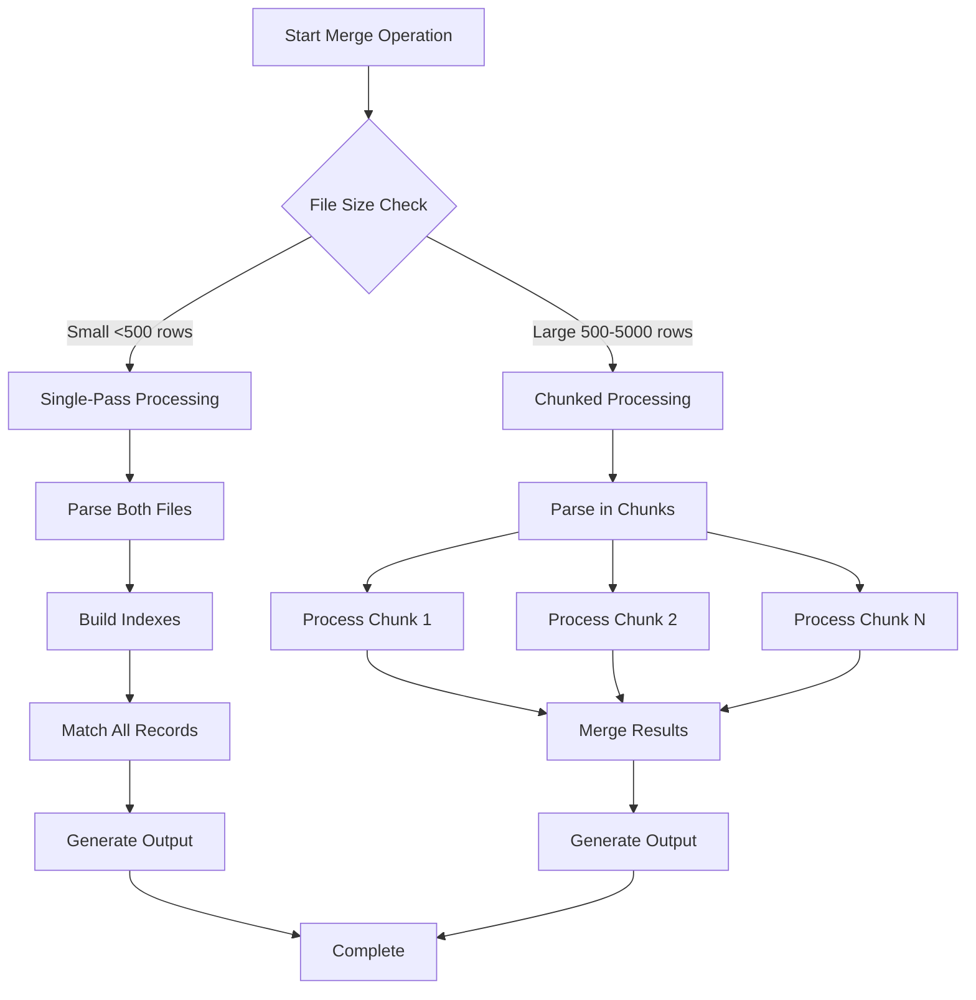

### Memory Management Pattern

```javascript
// Efficient batch processing to avoid memory limits

function processLargeDataset(salesLogData, cdkData) {
  const BATCH_SIZE = 100;
  const results = [];
  
  // Build CDK index once (kept in memory)
  const cdkIndex = buildStockIndex(cdkData);
  
  // Process sales log in batches
  for (let i = 0; i < salesLogData.length; i += BATCH_SIZE) {
    const batch = salesLogData.slice(i, i + BATCH_SIZE);
    const batchResults = matchBatch(batch, cdkIndex);
    
    results.push(...batchResults);
    
    // Checkpoint every 500 records
    if (i % 500 === 0) {
      saveCheckpoint({
        processedCount: i,
        results: results
      });
    }
    
    // Free memory hint
    if (i % 1000 === 0) {
      SpreadsheetApp.flush();
    }
  }
  
  return results;
}
```

## Summary

**Data Flow Characteristics**:

1. **Linear Pipeline**: Files → Parse → Normalize → Match → Merge → Output
2. **Stateful Processing**: Checkpoints enable resume on failure
3. **Batch Operations**: Prevents timeout and memory issues
4. **Immutable Source**: Never modifies original Sales Log data
5. **Audit Trail**: Complete history in MERGE_LOG
6. **User Control**: Preview and approval at key decision points

**Performance Profile**:
- Small datasets (<500 records): <1 minute, single-pass
- Medium datasets (500-2000 records): 1-3 minutes, checkpointed
- Large datasets (2000-5000 records): 3-6 minutes, chunked

**Reliability Features**:
- Checkpoint system for recovery
- Atomic merge operations (all or nothing)
- Extensive validation at each stage
- Detailed error reporting
- Undo capability (delete MERGED_DATA sheet)