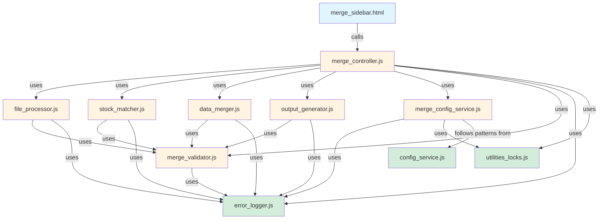

# Module and Component Design

## Overview

The Excel Data Merge Tool follows the established modular architecture pattern from Sales Log Pro, with clear separation between server-side processing and client-side UI components.

## Module Architecture

```
Excel Merge Tool Modules
├── Server-Side (Apps Script .js files)
│   ├── merge_controller.js       # Main orchestration & API
│   ├── file_processor.js          # Excel file parsing
│   ├── stock_matcher.js           # Matching algorithm
│   ├── data_merger.js             # Data combination logic
│   ├── output_generator.js        # Result formatting & writing
│   ├── merge_config_service.js    # Configuration management
│   └── merge_validator.js         # Validation rules
│
├── Client-Side (HTML files)
│   ├── merge_sidebar.html         # Main UI template
│   ├── merge_sidebar.css.html     # Styles
│   └── merge_sidebar.js.html      # Client JavaScript
│
└── Shared/Reused (Existing Sales Log Pro)
    ├── error_logger.js            # Error handling
    ├── utilities_locks.js         # Concurrency control
    └── config_service.js          # Configuration patterns
```

## Server-Side Modules

### 1. merge_controller.js

**Purpose**: Main orchestration module and public API for merge operations

**Responsibilities**:
- Coordinate multi-step merge workflow
- Manage operation state and checkpoints
- Handle user-facing API calls from sidebar
- Coordinate with other modules
- Manage LockService for concurrency
- Progress tracking and reporting

**Public Functions**:

```javascript
/**
 * Opens the merge sidebar interface
 * Called from custom menu item
 */
function openMergeSidebar();

/**
 * Processes uploaded Sales Log file
 * @param {Object} fileData - Base64 encoded file data
 * @param {string} fileName - Original file name
 * @param {string} sessionId - Unique session identifier
 * @returns {Object} {success, preview, rowCount, error}
 */
function uploadSalesLogFile(fileData, fileName, sessionId);

/**
 * Processes uploaded CDK export file
 * @param {Object} fileData - Base64 encoded file data
 * @param {string} fileName - Original file name
 * @param {string} sessionId - Unique session identifier
 * @returns {Object} {success, preview, rowCount, error}
 */
function uploadCDKFile(fileData, fileName, sessionId);

/**
 * Executes the merge operation with current configuration
 * @param {string} sessionId - Session identifier
 * @param {Object} options - Merge options from UI
 * @returns {Object} {success, matchReport, outputSheetName, error}
 */
function executeMerge(sessionId, options);

/**
 * Gets current merge session status and progress
 * @param {string} sessionId - Session identifier
 * @returns {Object} Progress information
 */
function getMergeProgress(sessionId);

/**
 * Cancels ongoing merge operation
 * @param {string} sessionId - Session identifier
 * @returns {Object} {success, message}
 */
function cancelMerge(sessionId);

/**
 * Cleans up merge session data
 * @param {string} sessionId - Session identifier
 */
function cleanupMergeSession(sessionId);
```

**Internal Functions**:

```javascript
/**
 * Validates merge prerequisites
 * @returns {Object} Validation result
 */
function validateMergePrerequisites(sessionId);

/**
 * Creates operation checkpoint
 * @param {Object} state - Current operation state
 */
function createMergeCheckpoint(state);

/**
 * Updates merge progress
 * @param {string} sessionId
 * @param {Object} progress
 */
function updateMergeProgress(sessionId, progress);

/**
 * Handles merge operation timeout
 * @param {string} sessionId
 * @returns {Object} Recovery options
 */
function handleMergeTimeout(sessionId);
```

**Dependencies**:
- `file_processor.js` - File parsing
- `stock_matcher.js` - Matching logic
- `data_merger.js` - Data combination
- `output_generator.js` - Output creation
- `merge_config_service.js` - Configuration
- `error_logger.js` - Error handling (existing)
- `utilities_locks.js` - Locking (existing)

**Error Handling**:
```javascript
// All public functions follow this pattern:
function publicFunction(params) {
  return withScriptLock(() => {
    try {
      // Validate inputs
      const validation = validateInputs(params);
      if (!validation.valid) {
        return { success: false, error: validation.error };
      }
      
      // Execute operation
      const result = executeOperation(params);
      
      return { success: true, ...result };
      
    } catch (error) {
      logError('publicFunction', error, { params });
      return {
        success: false,
        error: error.message,
        technicalDetails: error.stack
      };
    }
  });
}
```

---

### 2. file_processor.js

**Purpose**: Excel file parsing and data extraction

**Responsibilities**:
- Accept file uploads from client
- Convert Excel files to processable format
- Extract column data
- Validate file structure
- Handle both .xlsx and .csv formats
- Manage temporary Drive files

**Public Functions**:

```javascript
/**
 * Processes uploaded file and extracts data
 * @param {string} fileData - Base64 encoded file
 * @param {string} fileName - Original file name
 * @param {string} fileType - "salesLog" or "cdkExport"
 * @returns {Object} {success, data, columns, rowCount, error}
 */
function processUploadedFile(fileData, fileName, fileType);

/**
 * Validates file format and structure
 * @param {Object} fileMetadata - File metadata
 * @returns {Object} Validation result
 */
function validateFileFormat(fileMetadata);

/**
 * Extracts preview data from parsed file
 * @param {Array} allData - Complete file data
 * @param {number} rowCount - Number of preview rows
 * @returns {Array} Preview data
 */
function getPreviewData(allData, rowCount = 10);
```

**Internal Functions**:

```javascript
/**
 * Parses XLSX file using Drive API conversion
 * @param {string} fileId - Drive file ID
 * @returns {Array} Parsed data array
 */
function parseXLSXFile(fileId);

/**
 * Parses CSV file using Utilities.parseCsv
 * @param {string} csvContent - CSV file content
 * @returns {Array} Parsed data array
 */
function parseCSVFile(csvContent);

/**
 * Creates temporary file in Drive
 * @param {string} base64Data - File data
 * @param {string} fileName - File name
 * @returns {string} Drive file ID
 */
function createTempDriveFile(base64Data, fileName);

/**
 * Converts Excel file to Google Sheets
 * @param {string} fileId - Excel file ID in Drive
 * @returns {string} Converted Sheets ID
 */
function convertExcelToSheets(fileId);

/**
 * Reads data from converted Google Sheet
 * @param {string} sheetId - Sheet ID
 * @returns {Array} Data array
 */
function readSheetData(sheetId);

/**
 * Deletes temporary Drive files
 * @param {Array<string>} fileIds - Array of file IDs to delete
 */
function cleanupTempFiles(fileIds);

/**
 * Detects column structure from headers
 * @param {Array} headerRow - First row of data
 * @param {string} fileType - "salesLog" or "cdkExport"
 * @returns {Object} Column mapping
 */
function detectColumns(headerRow, fileType);
```

**Configuration**:
```javascript
const FILE_PROCESSOR_CONFIG = {
  MAX_FILE_SIZE: 50 * 1024 * 1024, // 50MB
  SUPPORTED_FORMATS: ['.xlsx', '.xls', '.csv'],
  TEMP_FILE_PREFIX: 'merge_temp_',
  TEMP_FILE_TTL: 3600, // 1 hour before cleanup
  MAX_PREVIEW_ROWS: 20,
  DRIVE_FOLDER_NAME: 'Sales_Log_Merge_Temp'
};
```

**Error Cases**:
- Invalid file format
- File size exceeds limit
- Corrupted Excel file
- Missing required columns
- Drive API quota exceeded
- Conversion timeout

---

### 3. stock_matcher.js

**Purpose**: Stock number matching algorithm implementation

**Responsibilities**:
- Build stock number indexes
- Execute multi-phase matching
- Calculate match confidence scores
- Handle disambiguation
- Generate match statistics

**Public Functions**:

```javascript
/**
 * Builds matching indexes from CDK data
 * @param {Array} cdkRecords - All CDK records
 * @param {Object} config - Matching configuration
 * @returns {Object} {exact, numeric, partial, stats}
 */
function buildStockIndexes(cdkRecords, config);

/**
 * Matches Sales Log records against CDK indexes
 * @param {Array} salesLogRecords - Sales log data
 * @param {Object} cdkIndexes - Pre-built indexes
 * @param {Object} config - Matching configuration
 * @returns {Object} Match results with statistics
 */
function matchRecords(salesLogRecords, cdkIndexes, config);

/**
 * Matches a single record (for manual review)
 * @param {Object} salesLogRecord - Single sales log record
 * @param {Object} cdkIndexes - Pre-built indexes
 * @param {Object} config - Matching configuration
 * @returns {Object} Match result
 */
function matchSingleRecord(salesLogRecord, cdkIndexes, config);

/**
 * Generates match quality report
 * @param {Object} matchResults - Results from matchRecords
 * @returns {Object} Statistical report
 */
function generateMatchReport(matchResults);
```

**Internal Functions**:

```javascript
// Normalization functions (as detailed in 04-matching-algorithm.md)
function normalizeExact(stockNumber);
function normalizeNumeric(stockNumber);
function normalizePartial(stockNumber, length);

// Matching functions
function matchPhaseExact(stockNumber, index, isNew);
function matchPhaseNumeric(stockNumber, index, isNew);
function matchPhasePartial(stockNumber, index, isNew, config);

// Disambiguation
function disambiguate(salesLogRecord, candidates);
function calculateMatchConfidence(salesLogRecord, cdkRecord, matchType);

// Validation
function validateStockType(cdkRecord, isNew);
function validateMatch(matchResult, salesLogRecord);
```

**Performance Optimization**:
```javascript
// Memoization for expensive operations
const normalizationCache = new Map();

function normalizeWithCache(stockNumber, normalizer) {
  const cacheKey = `${stockNumber}_${normalizer.name}`;
  
  if (normalizationCache.has(cacheKey)) {
    return normalizationCache.get(cacheKey);
  }
  
  const result = normalizer(stockNumber);
  normalizationCache.set(cacheKey, result);
  
  return result;
}
```

---

### 4. data_merger.js

**Purpose**: Combines matched Sales Log and CDK data

**Responsibilities**:
- Merge matched records
- Preserve original Sales Log structure
- Append CDK gross profit data
- Handle unmatched records
- Add match metadata columns
- Calculate derived fields

**Public Functions**:

```javascript
/**
 * Merges Sales Log and CDK data based on match results
 * @param {Array} salesLogRecords - Original sales log data
 * @param {Object} matchResults - Results from stock_matcher
 * @param {Object} config - Merge configuration
 * @returns {Object} {mergedData, unmatchedSales, unmatchedCDK, stats}
 */
function mergeData(salesLogRecords, matchResults, config);

/**
 * Creates merged record from Sales Log + CDK data
 * @param {Object} salesLogRecord - Sales log record
 * @param {Object} cdkRecord - Matched CDK record
 * @param {Object} matchInfo - Match metadata
 * @returns {Array} Merged row data
 */
function createMergedRecord(salesLogRecord, cdkRecord, matchInfo);

/**
 * Handles unmatched Sales Log records
 * @param {Object} salesLogRecord - Unmatched record
 * @returns {Array} Row with blank CDK columns
 */
function createUnmatchedSalesRecord(salesLogRecord);

/**
 * Calculates merge statistics
 * @param {Object} mergeResults - Results from mergeData
 * @returns {Object} Statistics summary
 */
function calculateMergeStatistics(mergeResults);
```

**Internal Functions**:

```javascript
/**
 * Extracts gross profit data from CDK record
 * @param {Object} cdkRecord - CDK record
 * @returns {Object} {frontGP, backGP, totalGP}
 */
function extractGrossProfitData(cdkRecord);

/**
 * Appends CDK columns to Sales Log row
 * @param {Array} salesLogRow - Original row data
 * @param {Object} gpData - Gross profit data
 * @param {Object} matchInfo - Match metadata
 * @returns {Array} Extended row
 */
function appendCDKColumns(salesLogRow, gpData, matchInfo);

/**
 * Validates merged record integrity
 * @param {Array} mergedRow - Merged row data
 * @returns {Object} Validation result
 */
function validateMergedRecord(mergedRow);

/**
 * Identifies unmatched CDK records
 * @param {Array} cdkRecords - All CDK records
 * @param {Object} matchResults - Match results
 * @returns {Array} Unmatched CDK records
 */
function findUnmatchedCDKRecords(cdkRecords, matchResults);
```

**Data Structures**:

```javascript
// Input: Sales Log record
const salesLogRecord = {
  rowNumber: 1,
  customerLastName: "Cain, Cornel",
  model: "CORV",
  fiNew: "C",
  stockNumberNew: "T5102344",
  tradeStockNew: "NT",
  salespersonNew: "JOHNSON,DAVID",
  fiUsed: "",
  stockNumberUsed: "",
  tradeStockUsed: "",
  salespersonUsed: ""
};

// Input: CDK record
const cdkRecord = {
  stockNo: "T5102344",
  stockType: "NEW",
  frontGP: 4689.00,
  backGP: 411.00,
  totalGP: 5100.00,
  contractDate: "2025-09-26",
  customer: "Cain, Cornel",
  model: "CORV",
  dealNo: 73154
  // ... other CDK columns
};

// Output: Merged record (array for sheet row)
const mergedRecord = [
  1,                          // A: Row number
  "Cain, Cornel",            // B: Customer
  "CORV",                    // C: Model
  "C",                       // D: FI (New)
  "T5102344",                // E: Stock # (New)
  "NT",                      // F: Trade Stock
  "JOHNSON,DAVID",           // G: Salesperson
  "", "", "", "", "", "", "", // H-N: Empty (used columns)
  4689.00,                   // O: Front GP$
  411.00,                    // P: Back GP$
  5100.00,                   // Q: Total GP$
  "exact",                   // R: Match Type
  "T5102344",                // S: Matched Stock
  "2025-09-26"               // T: CDK Contract Date
];
```

---

### 5. output_generator.js

**Purpose**: Generates final output sheets and reports

**Responsibilities**:
- Create/update MERGED_DATA sheet
- Format output with colors and styles
- Generate match statistics summary
- Create unmatched records report
- Update MERGE_LOG audit trail
- Apply conditional formatting

**Public Functions**:

```javascript
/**
 * Writes merged data to MERGED_DATA sheet
 * @param {Array} mergedData - Merged records array
 * @param {Object} metadata - Merge metadata
 * @returns {Object} {success, sheetName, error}
 */
function writeMergedDataSheet(mergedData, metadata);

/**
 * Generates match summary section at top of output
 * @param {Object} matchReport - Match statistics
 * @returns {Array} Summary rows for sheet
 */
function generateSummarySection(matchReport);

/**
 * Generates unmatched records report
 * @param {Array} unmatchedRecords - Unmatched sales log records
 * @param {Object} options - Report options
 * @returns {Array} Report rows
 */
function generateUnmatchedReport(unmatchedRecords, options);

/**
 * Updates MERGE_LOG sheet with operation record
 * @param {Object} mergeMetadata - Operation metadata
 */
function logMergeOperation(mergeMetadata);

/**
 * Applies formatting to MERGED_DATA sheet
 * @param {GoogleAppsScript.Spreadsheet.Sheet} sheet
 * @param {Object} formatConfig - Formatting configuration
 */
function applyOutputFormatting(sheet, formatConfig);
```

**Internal Functions**:

```javascript
/**
 * Creates MERGED_DATA sheet if not exists
 * @returns {GoogleAppsScript.Spreadsheet.Sheet}
 */
function getOrCreateMergedDataSheet();

/**
 * Clears existing MERGED_DATA content
 * @param {GoogleAppsScript.Spreadsheet.Sheet} sheet
 */
function clearMergedDataSheet(sheet);

/**
 * Writes header row with column names
 * @param {GoogleAppsScript.Spreadsheet.Sheet} sheet
 * @param {Array} columnNames
 */
function writeHeaderRow(sheet, columnNames);

/**
 * Writes data rows in batches for performance
 * @param {GoogleAppsScript.Spreadsheet.Sheet} sheet
 * @param {Array} data - 2D array
 * @param {number} startRow
 */
function writeDataBatch(sheet, data, startRow);

/**
 * Applies conditional formatting rules
 * @param {GoogleAppsScript.Spreadsheet.Sheet} sheet
 * @param {Object} rules - Formatting rules
 */
function applyConditionalFormatting(sheet, rules);

/**
 * Creates MERGE_LOG sheet if not exists
 * @returns {GoogleAppsScript.Spreadsheet.Sheet}
 */
function getOrCreateMergeLogSheet();
```

**Output Structure**:

```javascript
// MERGED_DATA sheet structure
const MERGED_DATA_COLUMNS = {
  // Original Sales Log columns (A-N)
  rowNumber: 0,        // A
  customer: 1,         // B
  model: 2,            // C
  fiNew: 3,            // D  (was C in original)
  stockNew: 4,         // E
  tradeNew: 5,         // F
  salespersonNew: 6,   // G
  // blank: 7-8,       // H-I
  fiUsed: 9,           // J  (was J in original)
  // blank: 10,        // K
  stockUsed: 11,       // L
  tradeUsed: 12,       // M
  salespersonUsed: 13, // N
  
  // Appended CDK data (O-T)
  frontGP: 14,         // O
  backGP: 15,          // P
  totalGP: 16,         // Q
  matchType: 17,       // R
  matchedStock: 18,    // S
  cdkDate: 19          // T
};

// Column headers
const HEADERS = [
  "#", "Customer", "Model", "FI", "Stock #", "Trade", "Salesperson",
  "", "", "FI", "", "Stock #", "Trade", "Salesperson",
  "Front GP$", "Back GP$", "Total GP$", "Match Type", 
  "Matched Stock", "CDK Date"
];
```

---

### 6. merge_config_service.js

**Purpose**: Configuration management for merge tool

**Responsibilities**:
- Save/load merge configurations
- Manage column mappings
- Store matching rules
- Handle user preferences
- Provide default configurations
- Validate configuration data

**Public Functions**:

```javascript
/**
 * Gets merge tool configuration
 * @returns {Object} Current configuration
 */
function getMergeConfiguration();

/**
 * Updates merge configuration
 * @param {Object} updates - Configuration updates
 * @returns {Object} Updated configuration
 */
function updateMergeConfiguration(updates);

/**
 * Resets configuration to defaults
 * @returns {Object} Default configuration
 */
function resetMergeConfiguration();

/**
 * Gets saved column mappings
 * @param {string} fileType - "salesLog" or "cdkExport"
 * @returns {Object} Column mapping
 */
function getColumnMapping(fileType);

/**
 * Saves column mapping for future use
 * @param {string} fileType
 * @param {Object} mapping
 */
function saveColumnMapping(fileType, mapping);
```

**Configuration Schema**:

```javascript
const MERGE_CONFIG_SCHEMA = {
  version: "1",
  columnMappings: {
    salesLog: {
      customerColumn: "B",
      modelColumn: "C",
      newFIColumn: "D",      // Changed from C to D
      newStockColumn: "E",
      newTradeColumn: "F",
      newSalespersonColumn: "G",
      usedFIColumn: "J",     // Changed from J to J
      usedStockColumn: "L",
      usedTradeColumn: "M",
      usedSalespersonColumn: "N",
      autoDetect: true
    },
    cdkExport: {
      stockNoColumn: "D",
      stockTypeColumn: "J",
      frontGPColumn: "K",
      backGPColumn: "L",
      totalGPColumn: "M",
      contractDateColumn: "A",
      customerColumn: "B",
      modelColumn: "I",
      dealNoColumn: "U",
      autoDetect: true
    }
  },
  matchingRules: {
    caseSensitive: false,
    trimWhitespace: true,
    ignoreLeadingZeros: true,
    enablePartialMatch: false,
    partialMatchLength: 6,
    autoApproveThreshold: 0.95,
    reviewThreshold: 0.70,
    useModelValidation: true,
    useCustomerValidation: false
  },
  outputSettings: {
    outputSheetName: "MERGED_DATA",
    includeUnmatched: true,
    highlightMatches: true,
    includeCDKDate: true,
    includeDealNumber: false,
    createSummary: true
  },
  lastModified: "2025-01-15T10:30:00Z",
  modifiedBy: "user@example.com"
};
```

**Storage**:
```javascript
// Properties Service key
const MERGE_CONFIG_KEY = "EXCEL_MERGE_CONFIG";

// Save/load pattern (following existing config_service.js)
function saveMergeConfig(config) {
  const props = PropertiesService.getDocumentProperties();
  props.setProperty(MERGE_CONFIG_KEY, JSON.stringify(config));
  
  // Invalidate cache
  CacheService.getScriptCache().remove('merge_config_cache');
}

function loadMergeConfig() {
  // Check cache first
  const cached = CacheService.getScriptCache().get('merge_config_cache');
  if (cached) {
    return JSON.parse(cached);
  }
  
  // Load from Properties
  const props = PropertiesService.getDocumentProperties();
  const configJson = props.getProperty(MERGE_CONFIG_KEY);
  
  if (configJson) {
    const config = JSON.parse(configJson);
    // Cache for 10 minutes
    CacheService.getScriptCache().put('merge_config_cache', configJson, 600);
    return config;
  }
  
  // Return defaults
  return MERGE_CONFIG_SCHEMA;
}
```

---

### 7. merge_validator.js

**Purpose**: Validation rules for merge operations

**Responsibilities**:
- Validate file formats
- Validate column structures
- Validate data integrity
- Validate match quality
- Provide validation error messages

**Public Functions**:

```javascript
/**
 * Validates uploaded file
 * @param {Object} fileData - File data and metadata
 * @returns {Object} {valid, errors, warnings}
 */
function validateUploadedFile(fileData);

/**
 * Validates Sales Log structure
 * @param {Array} data - Parsed data
 * @param {Object} detectedColumns - Detected column mapping
 * @returns {Object} Validation result
 */
function validateSalesLogStructure(data, detectedColumns);

/**
 * Validates CDK export structure
 * @param {Array} data - Parsed data
 * @param {Object} detectedColumns - Detected column mapping
 * @returns {Object} Validation result
 */
function validateCDKStructure(data, detectedColumns);

/**
 * Validates match quality before merge
 * @param {Object} matchResults - Match results
 * @param {Object} thresholds - Quality thresholds
 * @returns {Object} {acceptable, warnings, recommendations}
 */
function validateMatchQuality(matchResults, thresholds);

/**
 * Validates merged data before output
 * @param {Array} mergedData - Merged records
 * @returns {Object} Validation result
 */
function validateMergedData(mergedData);
```

**Validation Rules**:

```javascript
const VALIDATION_RULES = {
  salesLog: {
    requiredColumns: ['Customer', 'Model', 'Stock #'],
    minimumRows: 1,
    maximumRows: 10000,
    allowedFIFlags: /^[A-Z]$/,
    stockNumberPattern: /^[A-Z0-9\s-]+$/i
  },
  
  cdkExport: {
    requiredColumns: ['Stock No.', 'StockType', 'Front GP$', 'Back GP$', 'GP$'],
    minimumRows: 1,
    maximumRows: 10000,
    stockTypeValues: ['NEW', 'USED', 'N', 'U', 'S'],
    grossProfitRange: { min: -100000, max: 100000 }
  },
  
  matchQuality: {
    minimumMatchRate: 0.70,      // Warn if <70% matched
    maximumUnmatchedRate: 0.30,  // Warn if >30% unmatched
    minimumConfidence: 0.70      // Warn if avg confidence <0.70
  }
};
```

---

## Client-Side Components

### 8. merge_sidebar.html

**Purpose**: Main UI template for merge interface

**Structure**:

```html
<!DOCTYPE html>
<html>
<head>
  <base target="_top">
  <meta charset="UTF-8">
  <title>Merge CDK Data</title>
  
  <!-- Server-side data injection -->
  <script>
    window.MERGE_CONFIG = '<?!= getMergeConfiguration() ?>';
    window.SESSION_ID = '<?= Utilities.getUuid() ?>';
  </script>
  
  <?!= include('merge_sidebar.css') ?>
</head>
<body>
  <!-- Step 1: File Upload -->
  <div id="step-upload" class="step active">
    <div class="section-header">Upload Files</div>
    
    <div class="upload-section">
      <label>Sales Log Excel File</label>
      <input type="file" id="sales-log-file" accept=".xlsx,.xls,.csv">
      <div id="sales-log-status" class="file-status"></div>
    </div>
    
    <div class="upload-section">
      <label>CDK Export Excel File</label>
      <input type="file" id="cdk-file" accept=".xlsx,.xls,.csv">
      <div id="cdk-status" class="file-status"></div>
    </div>
    
    <button onclick="proceedToConfig()" class="btn-primary" disabled>
      Next: Configure Columns
    </button>
  </div>
  
  <!-- Step 2: Column Configuration -->
  <div id="step-config" class="step">
    <div class="section-header">Verify Column Mapping</div>
    
    <div class="config-section">
      <h4>Sales Log Columns</h4>
      <!-- Auto-detected mappings with override options -->
    </div>
    
    <div class="config-section">
      <h4>CDK Export Columns</h4>
      <!-- Auto-detected mappings with override options -->
    </div>
    
    <button onclick="startMatching()" class="btn-primary">
      Start Matching
    </button>
  </div>
  
  <!-- Step 3: Matching Progress -->
  <div id="step-matching" class="step">
    <div class="section-header">Matching Stock Numbers</div>
    
    <div class="progress-container">
      <div class="progress-bar">
        <div id="progress-fill" class="progress-fill"></div>
      </div>
      <div id="progress-text" class="progress-text">0%</div>
    </div>
    
    <div id="match-stats" class="stats-preview"></div>
  </div>
  
  <!-- Step 4: Review Results -->
  <div id="step-review" class="step">
    <div class="section-header">Review Match Results</div>
    
    <div class="results-summary">
      <!-- Match statistics -->
    </div>
    
    <div id="review-required" class="review-section">
      <!-- Records requiring manual review -->
    </div>
    
    <div class="button-group">
      <button onclick="approveMerge()" class="btn-primary">
        Approve & Merge
      </button>
      <button onclick="cancelMerge()" class="btn-secondary">
        Cancel
      </button>
    </div>
  </div>
  
  <!-- Step 5: Complete -->
  <div id="step-complete" class="step">
    <div class="section-header">✓ Merge Complete</div>
    
    <div class="completion-summary">
      <!-- Final statistics and output location -->
    </div>
    
    <button onclick="viewOutput()" class="btn-primary">
      View Merged Data
    </button>
    <button onclick="startNewMerge()" class="btn-secondary">
      Start New Merge
    </button>
  </div>
  
  <!-- Loading overlay -->
  <div id="loading" class="loading-overlay">
    <div class="spinner"></div>
    <div id="loading-message">Processing...</div>
  </div>
  
  <?!= include('merge_sidebar.js') ?>
</body>
</html>
```

**UI States**:
1. Upload (initial)
2. Configuration (after files uploaded)
3. Matching (processing)
4. Review (results ready)
5. Complete (merge finished)

---

### 9. merge_sidebar.css.html

**Purpose**: Styles for merge sidebar UI

**Key Styles**:

```html
<style>
  /* Consistent with Sales Log Pro config sidebar */
  
  :root {
    --primary-color: #4285f4;
    --success-color: #34a853;
    --warning-color: #fbbc04;
    --danger-color: #ea4335;
    --bg-light: #f8f9fa;
    --border-color: #e0e0e0;
  }
  
  /* Step-based navigation */
  .step {
    display: none;
  }
  
  .step.active {
    display: block;
    animation: fadeIn 0.3s;
  }
  
  /* Upload section */
  .upload-section {
    margin: 16px 0;
    padding: 16px;
    border: 2px dashed var(--border-color);
    border-radius: 8px;
  }
  
  .upload-section.has-file {
    border-color: var(--success-color);
    background-color: #e8f5e9;
  }
  
  /* Progress bar */
  .progress-container {
    margin: 20px 0;
  }
  
  .progress-bar {
    width: 100%;
    height: 24px;
    background-color: var(--bg-light);
    border-radius: 12px;
    overflow: hidden;
  }
  
  .progress-fill {
    height: 100%;
    background: linear-gradient(90deg, 
      var(--primary-color), 
      var(--success-color));
    transition: width 0.3s ease;
    width: 0%;
  }
  
  /* Match statistics */
  .stats-preview {
    display: grid;
    grid-template-columns: repeat(2, 1fr);
    gap: 12px;
    margin: 16px 0;
  }
  
  .stat-card {
    padding: 12px;
    background: var(--bg-light);
    border-radius: 8px;
    text-align: center;
  }
  
  .stat-value {
    font-size: 24px;
    font-weight: bold;
    color: var(--primary-color);
  }
  
  .stat-label {
    font-size: 12px;
    color: #666;
    margin-top: 4px;
  }
  
  /* Review cards */
  .review-card {
    border: 1px solid var(--border-color);
    border-radius: 8px;
    padding: 12px;
    margin: 8px 0;
    background: white;
  }
  
  .review-card.needs-attention {
    border-left: 4px solid var(--warning-color);
  }
  
  /* Confidence indicator */
  .confidence-badge {
    display: inline-block;
    padding: 4px 8px;
    border-radius: 4px;
    font-size: 11px;
    font-weight: bold;
  }
  
  .confidence-high { 
    background: #e8f5e9; 
    color: #2e7d32; 
  }
  
  .confidence-medium { 
    background: #fff8e1; 
    color: #f57f17; 
  }
  
  .confidence-low { 
    background: #ffebee; 
    color: #c62828; 
  }
</style>
```

---

### 10. merge_sidebar.js.html

**Purpose**: Client-side JavaScript for sidebar interactions

**Responsibilities**:
- Handle file input events
- Upload files to server
- Update UI based on server responses
- Manage step transitions
- Display progress
- Handle user interactions

**Key Functions**:

```javascript
// File upload handling
function handleSalesLogUpload(event) {
  const file = event.target.files[0];
  
  if (!validateFileClient(file)) {
    return;
  }
  
  showLoading(true, "Uploading Sales Log file...");
  
  const reader = new FileReader();
  reader.onload = function(e) {
    const base64Data = e.target.result.split(',')[1];
    
    google.script.run
      .withSuccessHandler(onSalesLogUploaded)
      .withFailureHandler(onUploadError)
      .uploadSalesLogFile(base64Data, file.name, window.SESSION_ID);
  };
  reader.readAsDataURL(file);
}

// Progress updates
function updateProgress(progress) {
  document.getElementById('progress-fill').style.width = progress.percentage + '%';
  document.getElementById('progress-text').textContent = 
    `${progress.processed} / ${progress.total} (${progress.percentage}%)`;
  
  // Update stats
  updateMatchStats(progress.stats);
}

// Step navigation
function moveToStep(stepName) {
  document.querySelectorAll('.step').forEach(s => 
    s.classList.remove('active'));
  document.getElementById('step-' + stepName).classList.add('active');
}

// Match review
function displayMatchResults(results) {
  const container = document.getElementById('review-required');
  
  if (results.requiresReview.length === 0) {
    container.innerHTML = '<p>No matches require manual review.</p>';
    return;
  }
  
  container.innerHTML = results.requiresReview.map(match => `
    <div class="review-card needs-attention">
      <div class="match-header">
        <strong>${match.stockNumber}</strong>
        <span class="confidence-badge confidence-medium">
          ${Math.round(match.confidence * 100)}% confidence
        </span>
      </div>
      <div class="match-details">
        <div>Sales Log: ${match.customer} - ${match.model}</div>
        <div>CDK Match: ${match.cdkData.customer} - ${match.cdkData.model}</div>
        <div class="match-type">Match Type: ${match.matchType}</div>
      </div>
      ${match.warnings ? renderWarnings(match.warnings) : ''}
      <div class="review-actions">
        <button onclick="approveMatch('${match.stockNumber}')" 
                class="btn-small btn-success">Approve</button>
        <button onclick="rejectMatch('${match.stockNumber}')" 
                class="btn-small btn-danger">Reject</button>
      </div>
    </div>
  `).join('');
}
```

---

## Shared Modules (Reused from Sales Log Pro)

### error_logger.js (Existing)

**Reuse Pattern**:
```javascript
// Import and use existing error logger
// No modifications needed

// Usage in merge modules:
logError('merge_controller', error, {
  operation: 'execute_merge',
  sessionId: sessionId,
  recordCount: count
});
```

### utilities_locks.js (Existing)

**Reuse Pattern**:
```javascript
// Use existing lock utilities
const lockResult = acquireScriptLockWithRetry();

if (!lockResult.success) {
  return {
    success: false,
    error: 'Could not acquire lock: ' + lockResult.error
  };
}

try {
  // Perform merge operation
} finally {
  lockResult.lock.releaseLock();
}
```

### config_service.js (Existing)

**Reuse Pattern**:
```javascript
// Follow same patterns for merge configuration
// Use similar function signatures
// Maintain consistency with existing config UI

// Shared utilities:
function sanitizeText(text);
function validateColor(colorHex);
function deepMerge(target, source);
```

---

## Module Dependencies Graph



## Module Interaction Patterns

### Pattern 1: File Upload Flow

```javascript
// Client (merge_sidebar.js.html)
function uploadFile(fileData, fileName, fileType) {
  google.script.run
    .withSuccessHandler(handleUploadSuccess)
    .withFailureHandler(handleUploadError)
    .uploadFile(fileData, fileName, fileType, SESSION_ID);
}

// Server (merge_controller.js)
function uploadFile(fileData, fileName, fileType, sessionId) {
  return withScriptLock(() => {
    // Validate
    const validation = merge_validator.validateUploadedFile({
      data: fileData,
      fileName: fileName,
      fileType: fileType
    });
    
    if (!validation.valid) {
      return { success: false, errors: validation.errors };
    }
    
    // Process
    const result = file_processor.processUploadedFile(
      fileData, 
      fileName, 
      fileType
    );
    
    if (result.success) {
      // Cache parsed data
      cacheSessionData(sessionId, fileType, result.data);
    }
    
    return result;
  });
}
```

### Pattern 2: Matching Execution Flow

```javascript
// Client (merge_sidebar.js.html)
function startMatching() {
  showStep('matching');
  
  google.script.run
    .withSuccessHandler(handleMatchComplete)
    .withFailureHandler(handleMatchError)
    .executeMerge(SESSION_ID, getUIOptions());
  
  // Start polling for progress
  progressInterval = setInterval(pollProgress, 1000);
}

// Server (merge_controller.js)
function executeMerge(sessionId, options) {
  return withScriptLock(() => {
    // Load cached file data
    const salesLogData = getCachedData(sessionId, 'salesLog');
    const cdkData = getCachedData(sessionId, 'cdk');
    
    // Get configuration
    const config = merge_config_service.getMergeConfiguration();
    const matchingRules = { ...config.matchingRules, ...options };
    
    // Build indexes
    const indexes = stock_matcher.buildStockIndexes(cdkData, matchingRules);
    
    // Execute matching
    const matchResults = stock_matcher.matchRecords(
      salesLogData, 
      indexes, 
      matchingRules
    );
    
    // Validate quality
    const qualityCheck = merge_validator.validateMatchQuality(
      matchResults,
      config.matchingRules
    );
    
    // Merge data
    const mergedData = data_merger.mergeData(
      salesLogData,
      matchResults,
      config
    );
    
    // Generate output
    const output = output_generator.writeMergedDataSheet(
      mergedData.merged,
      {
        sessionId: sessionId,
        matchReport: matchResults,
        timestamp: new Date().toISOString()
      }
    );
    
    return {
      success: true,
      matchReport: matchResults,
      outputSheet: output.sheetName,
      qualityCheck: qualityCheck
    };
  });
}
```

### Pattern 3: Configuration Management

```javascript
// Client (merge_sidebar.js.html)
function saveMatchingSettings() {
  const settings = {
    matchingRules: {
      ignoreLeadingZeros: document.getElementById('ignore-zeros').checked,
      enablePartialMatch: document.getElementById('partial-match').checked,
      // ... other settings
    }
  };
  
  google.script.run
    .withSuccessHandler(() => showToast('Settings saved'))
    .withFailureHandler(showError)
    .updateMergeConfiguration(settings);
}

// Server (merge_config_service.js)
function updateMergeConfiguration(updates) {
  return withScriptLock(() => {
    const current = getMergeConfiguration();
    const updated = deepMerge(current, updates);
    
    // Validate
    const validation = validateMergeConfiguration(updated);
    if (!validation.valid) {
      throw new Error('Invalid configuration: ' + validation.errors.join(', '));
    }
    
    // Save
    saveMergeConfig(updated);
    
    // Invalidate caches
    invalidateMergeCaches();
    
    return updated;
  });
}
```

## Module Size and Complexity Estimates

| Module | Lines of Code | Functions | Complexity |
|--------|---------------|-----------|------------|
| merge_controller.js | 400-500 | 15-20 | High |
| file_processor.js | 300-400 | 12-15 | Medium |
| stock_matcher.js | 400-500 | 15-20 | High |
| data_merger.js | 200-300 | 8-10 | Medium |
| output_generator.js | 300-400 | 10-12 | Medium |
| merge_config_service.js | 200-300 | 8-10 | Low |
| merge_validator.js | 250-350 | 12-15 | Medium |
| merge_sidebar.html | 300-400 | N/A | Low |
| merge_sidebar.css.html | 200-300 | N/A | Low |
| merge_sidebar.js.html | 400-500 | 20-25 | Medium |
| **Total** | **3,050-3,950** | **100-135** | |

**Estimated Development Effort**: 40-60 hours

## Coding Standards

### Naming Conventions

**Follow Sales Log Pro patterns**:

```javascript
// Functions: camelCase
function processUploadedFile() { }
function buildStockIndexes() { }

// Constants: UPPER_SNAKE_CASE
const BATCH_SIZE = 100;
const MAX_FILE_SIZE = 50 * 1024 * 1024;

// Private functions: camelCase with leading underscore
function _internalHelper() { }

// Public API functions: clear, descriptive names
function executeMerge() { }  // Good
function doIt() { }          // Bad
```

### Documentation Standards

**JSDoc for all public functions**:

```javascript
/**
 * Matches Sales Log records against CDK data
 * 
 * @param {Array} salesLogRecords - Sales log data array
 * @param {Object} cdkIndexes - Pre-built CDK indexes
 * @param {Object} config - Matching configuration
 * @returns {Object} Match results with statistics
 * 
 * @example
 * const results = matchRecords(salesLog, indexes, config);
 * console.log(`Matched: ${results.stats.matchRate * 100}%`);
 */
function matchRecords(salesLogRecords, cdkIndexes, config) {
  // Implementation
}
```

### Error Handling Pattern

**Consistent error handling**:

```javascript
function moduleFunction(params) {
  try {
    // Validate inputs
    if (!params) {
      throw new Error('Invalid parameters');
    }
    
    // Execute operation
    const result = performOperation(params);
    
    // Validate result
    if (!isValidResult(result)) {
      throw new Error('Invalid result generated');
    }
    
    return result;
    
  } catch (error) {
    // Log with context
    logError('moduleFunction', error, { 
      params: params,
      operation: 'description'
    });
    
    // Re-throw or return error object
    throw error; // For internal functions
    // OR
    return { success: false, error: error.message }; // For API functions
  }
}
```

## Testing Hooks

### Debug Mode Functions

```javascript
/**
 * Debug mode flag (set via Properties Service)
 */
function isDebugMode() {
  const props = PropertiesService.getScriptProperties();
  return props.getProperty('MERGE_DEBUG_MODE') === 'true';
}

/**
 * Debug logging (only in debug mode)
 */
function debugLog(module, message, data) {
  if (isDebugMode()) {
    Logger.log(`[DEBUG][${module}] ${message} ${JSON.stringify(data)}`);
  }
}

/**
 * Test data generator for development
 */
function generateTestMatchScenarios() {
  return {
    exactMatch: { /* ... */ },
    numericMatch: { /* ... */ },
    noMatch: { /* ... */ },
    duplicate: { /* ... */ }
  };
}
```

## Module Communication Protocol

### Request/Response Pattern

**Client to Server**:
```javascript
// Client
google.script.run
  .withSuccessHandler(callback)
  .withFailureHandler(errorCallback)
  .serverFunction(param1, param2);

// Server response format (standardized)
{
  success: true,
  data: { /* operation-specific data */ },
  metadata: {
    timestamp: "2025-01-15T10:30:00Z",
    executionTime: 1.5,
    recordsProcessed: 250
  },
  warnings: [], // Optional
  error: null
}
```

**Progress Updates**:
```javascript
// Server pushes progress via Cache Service
function updateProgress(sessionId, progress) {
  const cache = CacheService.getUserCache();
  cache.put(
    `merge_progress_${sessionId}`, 
    JSON.stringify(progress),
    600 // 10 min TTL
  );
}

// Client polls for progress
function pollProgress() {
  google.script.run
    .withSuccessHandler(updateProgressUI)
    .getMergeProgress(SESSION_ID);
}
```

## Module Versioning

### Version Strategy

**Module Versions**:
```javascript
// Each module exports version
const MODULE_VERSION = {
  name: 'file_processor',
  version: '1.0.0',
  compatibleWith: {
    'merge_controller': '>=1.0.0',
    'merge_validator': '>=1.0.0'
  }
};

// Version check on initialization
function checkModuleCompatibility() {
  const modules = [
    MODULE_VERSION_MERGE_CONTROLLER,
    MODULE_VERSION_FILE_PROCESSOR,
    // ... other modules
  ];
  
  // Verify all modules are compatible
  // Log warnings if version mismatches detected
}
```

## Summary

**Modular Design Principles**:

1. **Single Responsibility**: Each module has one clear purpose
2. **Loose Coupling**: Modules interact through well-defined interfaces
3. **High Cohesion**: Related functions grouped together
4. **Reusability**: Leverage existing Sales Log Pro utilities
5. **Testability**: Functions are unit-testable in isolation
6. **Maintainability**: Clear structure, good documentation

**Key Modules**:
- **merge_controller.js**: Orchestrates entire workflow (400-500 LOC)
- **stock_matcher.js**: Core matching algorithm (400-500 LOC)
- **file_processor.js**: Excel parsing (300-400 LOC)
- **output_generator.js**: Result generation (300-400 LOC)

**Integration Strategy**:
- Reuse existing utilities where possible
- Follow established patterns from Sales Log Pro
- Maintain consistency in error handling, logging, and configuration
- Minimal changes to existing codebase (only menu addition)