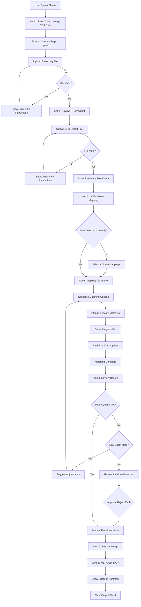

# UI/UX Design

## Overview

The Excel Data Merge Tool provides a step-by-step guided workflow through a Google Sheets sidebar interface. The design prioritizes simplicity for non-technical users while providing power users with advanced options.

## Design Principles

1. **Guided Workflow**: Clear step-by-step process with progress indication
2. **Visual Feedback**: Immediate response to all user actions
3. **Error Prevention**: Validation before allowing destructive operations
4. **Reversibility**: Allow users to go back and make changes
5. **Consistency**: Match existing Sales Log Pro UI patterns
6. **Accessibility**: Clear labels, adequate contrast, keyboard navigation

## User Workflow

### Complete User Journey



## Sidebar Interface Design

### Layout Structure

```
┌─────────────────────────────────────┐
│  Merge CDK Data        [X]          │ ← Header (350px width)
├─────────────────────────────────────┤
│  [●────────○──○──○]                │ ← Progress Indicator
│  Upload  Config  Match  Review      │
├─────────────────────────────────────┤
│                                     │
│  [Current Step Content]             │ ← Main Content Area
│                                     │ (Scrollable)
│                                     │
│                                     │
│                                     │
│                                     │
├─────────────────────────────────────┤
│  [← Back]              [Next →]    │ ← Action Buttons
└─────────────────────────────────────┘
```

**Dimensions**:
- Width: 350px (standard sidebar)
- Height: 100% (full viewport)
- Scrollable content area
- Fixed header and footer

### Step 1: File Upload Interface

```
┌─────────────────────────────────────┐
│  Step 1: Upload Files               │
├─────────────────────────────────────┤
│                                     │
│  Sales Log Excel File               │
│  ┌─────────────────────────────┐   │
│  │  📁 Choose File...          │   │ ← File input
│  └─────────────────────────────┘   │
│  [ ] or drag and drop here          │
│                                     │
│  Status: Not uploaded               │ ← Dynamic status
│  ─────────────────────────────────  │
│                                     │
│  CDK Export Excel File              │
│  ┌─────────────────────────────┐   │
│  │  📁 Choose File...          │   │
│  └─────────────────────────────┘   │
│  [ ] or drag and drop here          │
│                                     │
│  Status: Not uploaded               │
│                                     │
│  ─────────────────────────────────  │
│  ℹ️ Supported: .xlsx, .xls, .csv   │
│  Max size: 50MB                     │
│                                     │
│             [Next: Configure]       │ ← Disabled until both uploaded
└─────────────────────────────────────┘
```

**After Successful Upload**:

```
┌─────────────────────────────────────┐
│  Sales Log Excel File               │
│  ┌─────────────────────────────┐   │
│  │  ✓ september.xlsx           │   │ ← Success indicator
│  └─────────────────────────────┘   │
│  [×] Remove                         │ ← Remove option
│                                     │
│  ✓ Uploaded successfully            │
│  • 250 records detected             │ ← File statistics
│  • Columns: A-N (14 columns)        │
│                                     │
│  Preview (first 5 rows):            │
│  ┌─────────────────────────────┐   │
│  │ Customer    Model   Stock#  │   │ ← Data preview
│  │ Cain        CORV    T510... │   │
│  │ Handrinos   EQUIN   TL17... │   │
│  └─────────────────────────────┘   │
└─────────────────────────────────────┘
```

### Step 2: Column Configuration Interface

```
┌─────────────────────────────────────┐
│  Step 2: Verify Column Mapping      │
├─────────────────────────────────────┤
│                                     │
│  Sales Log Columns                  │
│  ┌─────────────────────────────┐   │
│  │ ✓ Auto-detected             │   │ ← Auto-detection badge
│  └─────────────────────────────┘   │
│                                     │
│  New Vehicle Stock #:  [E ▼]        │ ← Dropdown selectors
│  Used Vehicle Stock #: [L ▼]        │
│  Customer Name:        [B ▼]        │
│  Model:                [C ▼]        │
│                                     │
│  ─────────────────────────────────  │
│                                     │
│  CDK Export Columns                 │
│  ┌─────────────────────────────┐   │
│  │ ✓ Auto-detected             │   │
│  └─────────────────────────────┘   │
│                                     │
│  Stock Number:     [D ▼]            │
│  Stock Type:       [J ▼]            │
│  Front GP$:        [K ▼]            │
│  Back GP$:         [L ▼]            │
│  Total GP$:        [M ▼]            │
│                                     │
│  ─────────────────────────────────  │
│                                     │
│  Matching Options                   │
│  ☑ Ignore leading zeros             │ ← Checkboxes
│  ☑ Case insensitive                 │
│  ☐ Enable partial matching          │
│                                     │
│  [Save as Default]                  │ ← Save config
│                                     │
│  [← Back]           [Start Match →] │
└─────────────────────────────────────┘
```

**Advanced Options (Collapsed by Default)**:

```
│  ▶ Advanced Matching Options       │ ← Expandable
│  (click to expand)                  │
```

**When Expanded**:

```
│  ▼ Advanced Matching Options        │
│  ┌─────────────────────────────┐   │
│  │ Partial match length: [6▼]  │   │
│  │ Min confidence:      [70%▼] │   │
│  │ ☑ Use model validation      │   │
│  │ ☐ Use customer validation   │   │
│  └─────────────────────────────┘   │
```

### Step 3: Matching Progress Interface

```
┌─────────────────────────────────────┐
│  Step 3: Matching Stock Numbers     │
├─────────────────────────────────────┤
│                                     │
│  Processing...                      │
│  ┌─────────────────────────────┐   │
│  │ ███████████░░░░░░░░░░░░     │   │ ← Animated progress
│  └─────────────────────────────┘   │
│  152 / 250 records (61%)            │ ← Progress text
│                                     │
│  ─────────────────────────────────  │
│                                     │
│  Match Statistics (Live)            │
│  ┌──────────────┬──────────────┐   │
│  │  Exact Match │     135      │   │ ← Live stats
│  │  Numeric     │      12      │   │
│  │  Partial     │       2      │   │
│  │  Unmatched   │       3      │   │
│  └──────────────┴──────────────┘   │
│                                     │
│  Estimated time remaining: 8s       │ ← Time estimate
│                                     │
│  [Cancel Operation]                 │ ← Cancel option
└─────────────────────────────────────┘
```

**Animation**: 
- Smooth progress bar animation
- Real-time stat updates (every 100 records)
- Spinner for indeterminate operations

### Step 4: Review Results Interface

```
┌─────────────────────────────────────┐
│  Step 4: Review Match Results       │
├─────────────────────────────────────┤
│                                     │
│  Match Summary                      │
│  ┌─────────────────────────────┐   │
│  │ ✓ 247 / 250 matched (98.8%) │   │ ← Overall stats
│  │                              │   │
│  │ Breakdown:                   │   │
│  │ • Exact matches:      235    │   │
│  │ • Numeric matches:     10    │   │
│  │ • Partial matches:      2    │   │
│  │                              │   │
│  │ ⚠️ Requires review:      2    │   │
│  │ ✗ Unmatched:             3    │   │
│  └─────────────────────────────┘   │
│                                     │
│  ─────────────────────────────────  │
│                                     │
│  ⚠️ Items Requiring Review (2)      │ ← Expand/collapse
│  ┌─────────────────────────────┐   │
│  │ Stock: T5102345             │   │ ← Review card
│  │ Type: Partial match (75%)   │   │
│  │                              │   │
│  │ Sales Log:                   │   │
│  │ • Smith, John - TRAV        │   │
│  │                              │   │
│  │ CDK Match:                   │   │
│  │ • Smith, J - TRAV           │   │
│  │                              │   │
│  │ ⚠️ Warning: Customer name    │   │
│  │    differs slightly          │   │
│  │                              │   │
│  │ [✓ Approve] [✗ Reject]      │   │ ← Action buttons
│  └─────────────────────────────┘   │
│                                     │
│  ✗ Unmatched Records (3)            │ ← Expand/collapse
│  [Show Details ▼]                   │
│                                     │
│  ─────────────────────────────────  │
│                                     │
│  [← Adjust Settings]                │
│              [Approve & Merge →]    │ ← Primary action
└─────────────────────────────────────┘
```

**Review Card Details**:

```
┌─────────────────────────────────────┐
│ Stock: ABC123                       │
│ [75%] Partial Match                 │ ← Confidence badge
│ ─────────────────────────────────── │
│ Sales Log Row 15:                   │
│ • Customer: Johnson, Mary           │
│ • Model: SILV15                     │
│ • Stock: ABC123                     │
│                                     │
│ Potential CDK Match:                │
│ • Customer: Johnson, M.             │
│ • Model: SILV15                     │
│ • Stock: XY-ABC123                  │
│ • GP$: $2,500                       │
│                                     │
│ Warnings:                           │
│ ⚠️ Stock prefix differs              │
│ ℹ️ Customer name similar (85%)      │
│                                     │
│ Alternatives (1):                   │
│ • ABC123-A (Model: TRAV) [40%]      │
│                                     │
│ [✓ Approve] [✗ Reject] [See Alt.]  │
└─────────────────────────────────────┘
```

### Step 5: Completion Interface

```
┌─────────────────────────────────────┐
│  ✓ Merge Complete                   │
├─────────────────────────────────────┤
│                                     │
│  📊 Merge Summary                   │
│  ┌─────────────────────────────┐   │
│  │ Operation completed at       │   │
│  │ 2:45 PM on Jan 15, 2025     │   │
│  │                              │   │
│  │ Processed: 250 records       │   │
│  │ Matched:   247 records       │   │
│  │ Merged:    247 records       │   │
│  │                              │   │
│  │ Processing time: 23 seconds  │   │
│  └─────────────────────────────┘   │
│                                     │
│  Output Location:                   │
│  📄 MERGED_DATA sheet               │ ← Link to sheet
│  (Click to view)                    │
│                                     │
│  Unmatched Records:                 │
│  📄 3 records in UNMATCHED tab      │ ← Link to tab
│  (Click to review)                  │
│                                     │
│  ─────────────────────────────────  │
│                                     │
│  Next Steps:                        │
│  • Review merged data               │
│  • Check unmatched records          │
│  • Update Sales Log if needed       │
│                                     │
│  [View Merged Data]                 │ ← Navigate to output
│  [Start New Merge]                  │ ← Reset workflow
│  [Close]                            │
└─────────────────────────────────────┘
```

## Interactive Elements

### File Upload Component

**Visual States**:

```
Empty State:
┌─────────────────────────────────┐
│  📁 Drop file here or click     │
│     to browse                   │
│                                 │
│  Supported: .xlsx, .xls, .csv   │
└─────────────────────────────────┘

Hover State (Drag Over):
┌─────────────────────────────────┐
│  📁 Drop file here              │ ← Blue border, light bg
│                                 │
└─────────────────────────────────┘

Uploading State:
┌─────────────────────────────────┐
│  ⏳ Uploading...                │ ← Animated spinner
│  september.xlsx (45%)            │
│  ████████░░░░░░░░░░░            │ ← Progress bar
└─────────────────────────────────┘

Success State:
┌─────────────────────────────────┐
│  ✓ september.xlsx               │ ← Green checkmark
│  250 records • 14 columns        │
│  [× Remove]                     │ ← Remove button
└─────────────────────────────────┘

Error State:
┌─────────────────────────────────┐
│  ✗ invalid_file.txt             │ ← Red X
│  Error: Unsupported file format │
│  [Try Again]                    │
└─────────────────────────────────┘
```

### Column Mapping Dropdown

```
Stock Number Column: [E ▼]
                     ↓
┌─────────────────────────┐
│ ● E - Stock # (Detected)│ ← Auto-detected (selected)
│   D - FI                │
│   F - Trade Stock       │
│   L - Stock # (Used)    │
│   [Custom...]           │ ← Manual entry option
└─────────────────────────┘
```

### Confidence Badge

Visual indicators for match confidence:

```
[99%]  ← Green badge, exact/numeric matches
[75%]  ← Yellow badge, partial matches needing review
[50%]  ← Red badge, low confidence (likely wrong)
```

### Progress Indicator (Top Bar)

```
Step 1      Step 2      Step 3      Step 4
  ●─────────○─────────○─────────○
Active    Pending     Pending     Pending

Step 1      Step 2      Step 3      Step 4
  ●─────────●─────────●─────────○
Complete  Complete    Active    Pending
```

## User Interactions

### Interaction Pattern: File Upload

**User Action** → **System Response**

1. **Click "Choose File"**
   - File picker dialog opens
   - Native OS file browser

2. **Select file**
   - Validate file type (client-side)
   - If invalid: Show error immediately
   - If valid: Show "Uploading..." state

3. **Upload in progress**
   - Progress bar animates
   - Percentage updates (0-100%)
   - Status text: "Uploading september.xlsx..."

4. **Upload complete**
   - Success checkmark appears
   - File statistics display
   - Preview data loads
   - "Next" button enables (if both files uploaded)

5. **Error during upload**
   - Error icon appears
   - Clear error message
   - "Try Again" button
   - Option to select different file

### Interaction Pattern: Match Review

**Scenario 1: High Confidence Match**

User sees:
```
✓ Stock T5102344
  [99%] Exact Match
  
  Sales Log: Cain, Cornel - CORV
  CDK Match: Cain, Cornel - CORV
  GP: $5,100
  
  No action needed - auto-approved
```

**Scenario 2: Medium Confidence (Needs Review)**

User sees:
```
⚠️ Stock T5102345
   [75%] Partial Match
   
   Sales Log: Smith, John - TRAV
   CDK Match: Smith, J - TRAV
   
   ⚠️ Customer name differs slightly
   
   [✓ Approve] [✗ Reject] [See Alternatives]
```

User clicks "✓ Approve":
- Card turns green
- Checkmark appears
- Match approved
- Count updates: "1 reviewed"

User clicks "See Alternatives":
```
Alternatives for T5102345:
┌────────────────────────────────┐
│ 1. Stock: T5102345-A           │
│    Customer: Smith, John       │
│    Model: CORV                 │
│    Confidence: 40%             │
│    [Select This]               │
│                                │
│ 2. Stock: T5102346             │
│    Customer: Smith, Jane       │
│    Model: TRAV                 │
│    Confidence: 30%             │
│    [Select This]               │
│                                │
│ [Keep Original] [Reject All]   │
└────────────────────────────────┘
```

### Interaction Pattern: Error Recovery

**Scenario: Upload Fails**

```
┌─────────────────────────────────────┐
│  ✗ Upload Failed                    │
│                                     │
│  Error uploading september.xlsx     │
│                                     │
│  Reason: File size exceeds 50MB     │
│                                     │
│  Suggestions:                       │
│  • Export data to CSV (smaller)     │
│  • Split file into multiple parts   │
│  • Remove unnecessary sheets        │
│                                     │
│  [Try Different File]               │
│  [Learn More]                       │ ← Help link
└─────────────────────────────────────┘
```

**Scenario: Low Match Rate**

```
┌─────────────────────────────────────┐
│  ⚠️ Low Match Rate Detected          │
│                                     │
│  Only 45% of records matched        │
│  (113 / 250)                        │
│                                     │
│  Common causes:                     │
│  • Wrong file uploaded              │
│  • Column mapping incorrect         │
│  • Different time periods           │
│                                     │
│  Recommendations:                   │
│  1. Verify you uploaded correct     │
│     CDK export for this month       │
│  2. Check column mappings           │
│  3. Enable partial matching         │
│                                     │
│  [← Adjust Settings]                │
│  [Continue Anyway]                  │ ← Allow override
└─────────────────────────────────────┘
```

## Visual Design Specifications

### Color Palette

Following Sales Log Pro patterns:

```css
:root {
  /* Primary colors */
  --primary-blue: #4285f4;
  --primary-dark: #1a73e8;
  
  /* Status colors */
  --success-green: #34a853;
  --warning-yellow: #fbbc04;
  --danger-red: #ea4335;
  --info-blue: #4285f4;
  
  /* Backgrounds */
  --bg-primary: #ffffff;
  --bg-secondary: #f8f9fa;
  --bg-hover: #e8f0fe;
  
  /* Text */
  --text-primary: #202124;
  --text-secondary: #5f6368;
  --text-disabled: #9aa0a6;
  
  /* Borders */
  --border-color: #dadce0;
  --border-focus: #4285f4;
  
  /* Confidence indicators */
  --confidence-high: #e8f5e9;
  --confidence-medium: #fff8e1;
  --confidence-low: #ffebee;
}
```

### Typography

```css
/* Following Calibri pattern from Sales Log Pro */
body {
  font-family: 'Calibri', 'Segoe UI', Arial, sans-serif;
  font-size: 14px;
  line-height: 1.5;
  color: var(--text-primary);
}

h3.section-header {
  font-size: 16px;
  font-weight: bold;
  margin: 0 0 16px 0;
  color: var(--text-primary);
}

.help-text {
  font-size: 12px;
  color: var(--text-secondary);
  margin-top: 4px;
}

.stat-value {
  font-size: 24px;
  font-weight: bold;
  color: var(--primary-blue);
}
```

### Spacing System

```css
/* Consistent spacing scale */
--spacing-xs: 4px;
--spacing-sm: 8px;
--spacing-md: 16px;
--spacing-lg: 24px;
--spacing-xl: 32px;

/* Apply to components */
.upload-section {
  padding: var(--spacing-md);
  margin: var(--spacing-md) 0;
}

.button-group {
  margin-top: var(--spacing-lg);
}
```

### Component Styling

**Buttons**:

```css
.btn-primary {
  background: var(--primary-blue);
  color: white;
  border: none;
  padding: 10px 20px;
  border-radius: 4px;
  font-weight: 500;
  cursor: pointer;
  transition: background 0.2s;
}

.btn-primary:hover {
  background: var(--primary-dark);
}

.btn-primary:disabled {
  background: var(--text-disabled);
  cursor: not-allowed;
}

.btn-secondary {
  background: transparent;
  color: var(--primary-blue);
  border: 1px solid var(--border-color);
  padding: 10px 20px;
  border-radius: 4px;
}
```

**Cards**:

```css
.review-card {
  background: white;
  border: 1px solid var(--border-color);
  border-radius: 8px;
  padding: 16px;
  margin: 12px 0;
  box-shadow: 0 1px 3px rgba(0,0,0,0.1);
}

.review-card.needs-attention {
  border-left: 4px solid var(--warning-yellow);
}

.review-card.approved {
  border-left: 4px solid var(--success-green);
  opacity: 0.7;
}
```

## Responsive Behavior

### Sidebar Width Adaptation

```css
/* Standard sidebar: 350px */
@media (max-width: 350px) {
  /* Reduce padding for narrow screens */
  .upload-section {
    padding: var(--spacing-sm);
  }
  
  .button-group {
    flex-direction: column;
  }
  
  .button-group button {
    width: 100%;
    margin: 4px 0;
  }
}

/* Scrolling behavior */
.step {
  max-height: calc(100vh - 150px);
  overflow-y: auto;
  padding: 16px;
}
```

## Accessibility Features

### Keyboard Navigation

```javascript
// Tab order
tabindex="0" for all interactive elements

// Keyboard shortcuts
document.addEventListener('keydown', function(e) {
  // Ctrl/Cmd + Enter = Proceed to next step
  if ((e.ctrlKey || e.metaKey) && e.key === 'Enter') {
    proceedToNextStep();
  }
  
  // Escape = Cancel operation
  if (e.key === 'Escape') {
    cancelCurrentOperation();
  }
});
```

### Screen Reader Support

```html
<!-- Aria labels for clarity -->
<button aria-label="Upload Sales Log Excel file">
  Choose File
</button>

<div role="progressbar" 
     aria-valuenow="61" 
     aria-valuemin="0" 
     aria-valuemax="100"
     aria-label="Matching progress">
</div>

<!-- Status announcements -->
<div role="status" aria-live="polite" id="status-announcer">
  <!-- Dynamically updated for screen readers -->
</div>
```

### Color Contrast

All text/background combinations meet WCAG AA standards (4.5:1 ratio):

| Element | Foreground | Background | Ratio |
|---------|------------|------------|-------|
| Primary text | #202124 | #ffffff | 15.8:1 ✓ |
| Secondary text | #5f6368 | #ffffff | 7.7:1 ✓ |
| Button text | #ffffff | #4285f4 | 4.8:1 ✓ |
| Error text | #c62828 | #ffebee | 7.2:1 ✓ |

## Error Messages and Guidance

### Error Message Patterns

**Structure**:
1. What went wrong (clear, non-technical)
2. Why it happened (if known)
3. How to fix it (actionable steps)

**Examples**:

```
❌ File Upload Failed

The file you selected couldn't be uploaded.

Reason: File size (75 MB) exceeds the maximum 
allowed size (50 MB).

To fix this:
1. Export your data as CSV instead of XLSX
2. Or, remove unnecessary sheets from the workbook
3. Or, split the data into multiple smaller files

[Try Again] [Learn More]
```

```
⚠️ Low Match Rate

Only 113 out of 250 records (45%) could be matched.
This is lower than expected.

This usually means:
• Wrong CDK file for this time period
• Column mappings need adjustment
• Stock numbers formatted differently than expected

What would you like to do?
[← Review Column Settings]
[Enable Partial Matching]
[Continue Anyway]
```

### Help Text Examples

**Inline Help**:

```
Stock Number Column: [E ▼]
ℹ️ The column containing stock numbers in your Sales Log.
   For new vehicles, typically column E.
   For used vehicles, typically column L.
```

**Tooltip Help** (hover):

```
[Ignore Leading Zeros] (?)
  ↓ (on hover)
┌────────────────────────────────┐
│ When enabled, stock numbers    │
│ like "001234" will match "1234"│
│                                │
│ Recommended: ON (checked)      │
└────────────────────────────────┘
```

## Loading and Progress States

### Spinner Animation

```css
@keyframes spin {
  0% { transform: rotate(0deg); }
  100% { transform: rotate(360deg); }
}

.spinner {
  border: 3px solid var(--bg-secondary);
  border-top: 3px solid var(--primary-blue);
  border-radius: 50%;
  width: 40px;
  height: 40px;
  animation: spin 1s linear infinite;
}
```

### Progress States

**Indeterminate** (unknown duration):
```
⏳ Uploading file...
⏳ Processing Excel format...
⏳ Building indexes...
```

**Determinate** (known progress):
```
Progress: 152 / 250 (61%)
████████████░░░░░░░░░░░
Estimated time: 12 seconds
```

**Near Complete**:
```
Progress: 247 / 250 (99%)
████████████████████████
Finalizing results...
```

## Notification Patterns

### Toast Notifications

**Success**:
```
┌─────────────────────────────┐
│ ✓ Configuration saved       │ ← 3 second auto-dismiss
└─────────────────────────────┘
```

**Warning**:
```
┌─────────────────────────────┐
│ ⚠️ 3 records need review     │ ← 5 second auto-dismiss
└─────────────────────────────┘
```

**Error**:
```
┌─────────────────────────────┐
│ ✗ Matching failed            │ ← Manual dismiss only
│   [Dismiss] [View Details]   │
└─────────────────────────────┘
```

### Confirmation Dialogs

**Pattern**:

```javascript
// Before destructive operations
const confirmed = confirm(
  'Start New Merge?\n\n' +
  'This will discard the current session data.\n\n' +
  'Are you sure?'
);

if (confirmed) {
  resetMergeSession();
}
```

**Critical Actions**:
- Starting new merge (discards current)
- Canceling in-progress operation
- Overwriting existing MERGED_DATA sheet

## Mobile Considerations

### Not Optimized for Mobile

**Rationale**:
- Google Sheets on mobile has limited sidebar support
- Complex file uploads difficult on mobile
- Target users work on desktop
- Focus on desktop-first experience

**Minimum Support**:
- Sidebar opens on tablet (768px+)
- Shows "Use desktop for best experience" on phone
- Basic functionality works on iPad

## Accessibility Checklist

- [x] Keyboard navigation for all actions
- [x] Screen reader announcements for status changes
- [x] Sufficient color contrast (WCAG AA)
- [x] Clear focus indicators
- [x] Descriptive aria-labels
- [x] Logical tab order
- [x] Error messages associated with inputs
- [x] Progress announced to screen readers

## Performance Optimization

### UI Responsiveness

**Targets**:
- Initial render: <100ms
- Step transition: <50ms
- File upload feedback: Immediate (<10ms)
- Server call response: Show loading after 200ms

**Techniques**:

```javascript
// Debounce rapid inputs
const debouncedValidate = debounce(validateInput, 300);
input.addEventListener('input', debouncedValidate);

// Lazy load previews
function loadPreview() {
  requestIdleCallback(() => {
    // Load preview data when browser is idle
    renderPreviewData();
  });
}

// Virtual scrolling for large lists
function renderLargeList(items) {
  // Only render visible items + buffer
  const visibleItems = getVisibleItems(items, scrollPosition);
  renderItems(visibleItems);
}
```

## User Experience Flows

### Happy Path (95% of cases)

1. **Upload files** (30 seconds)
   - Select Sales Log: 10s
   - Select CDK Export: 10s
   - Both validate successfully: 10s

2. **Verify configuration** (10 seconds)
   - Auto-detection works
   - Quick glance at mappings
   - Click "Start Match"

3. **Matching** (20 seconds automated)
   - Watch progress bar
   - See stats update in real-time
   - Automatic completion

4. **Review** (30 seconds)
   - See 98% match rate
   - 0-2 items need review
   - Quickly approve/reject
   - Click "Approve & Merge"

5. **Complete** (10 seconds)
   - See success message
   - Click "View Merged Data"
   - Review output sheet

**Total Time**: ~2 minutes

### Error Recovery Path

1. **Upload wrong file**
   - See error immediately
   - Clear explanation
   - Remove and try again
   - +1 minute

2. **Low match rate**
   - See warning
   - Adjust column mappings
   - Re-run matching
   - +2 minutes

3. **Many items need review**
   - Batch approve similar items
   - Reject obvious wrong matches
   - +5 minutes for 20 items

## Mockups and Wireframes

### Home State

```
┌───────────────────────────────────────┐
│  Merge CDK Data              [X]      │
├───────────────────────────────────────┤
│  [●────○────○────○]                  │
│  Upload Config Match Review           │
├───────────────────────────────────────┤
│                                       │
│  Step 1: Upload Files                 │
│                                       │
│  ┌─────────────────────────────────┐ │
│  │  Sales Log Excel File           │ │
│  │                                 │ │
│  │  📁 september.xlsx              │ │
│  │  ✓ 250 records • 14 columns     │ │
│  │  [× Remove]                     │ │
│  └─────────────────────────────────┘ │
│                                       │
│  ┌─────────────────────────────────┐ │
│  │  CDK Export Excel File          │ │
│  │                                 │ │
│  │  📁 cdk_september.xlsx          │ │
│  │  ✓ 250 records • 21 columns     │ │
│  │  [× Remove]                     │ │
│  └─────────────────────────────────┘ │
│                                       │
│  Both files ready for processing     │
│                                       │
│             [Next: Configure →]       │
├───────────────────────────────────────┤
│  Need help? [View Documentation]      │
└───────────────────────────────────────┘
```

### Processing State

```
┌───────────────────────────────────────┐
│  Merge CDK Data              [X]      │
├───────────────────────────────────────┤
│  [●────●────●────○]                  │
│  Upload Config Match Review           │
├───────────────────────────────────────┤
│                                       │
│  Step 3: Matching Stock Numbers       │
│                                       │
│  ⏳ Processing 250 records...         │
│                                       │
│  ┌─────────────────────────────────┐ │
│  │ ███████████████░░░░░░░░░░       │ │
│  └─────────────────────────────────┘ │
│  185 / 250 (74%)                      │
│                                       │
│  Time elapsed: 14s                    │
│  Estimated remaining: 6s              │
│                                       │
│  ┌──────────────┬──────────────────┐ │
│  │ Exact        │       165        │ │
│  │ Numeric      │        15        │ │
│  │ Partial      │         3        │ │
│  │ Unmatched    │         2        │ │
│  └──────────────┴──────────────────┘ │
│                                       │
│           [Cancel Operation]          │
└───────────────────────────────────────┘
```

## User Testing Scenarios

### Scenario 1: First-Time User

**Goal**: Complete a merge without prior experience

**Expected Flow**:
1. Sees clear "Merge CDK Data" menu item
2. Sidebar opens with step indicator
3. Instructions explain what files are needed
4. Drag-and-drop or click to upload
5. Auto-detection handles configuration
6. Watches progress during matching
7. Reviews any flagged items with clear guidance
8. Approves and sees success message
9. Clicks to view output

**Success Criteria**: Completes merge in <5 minutes without help

### Scenario 2: Power User

**Goal**: Customize settings and handle edge cases

**Expected Flow**:
1. Opens merge sidebar
2. Uploads files quickly
3. Expands advanced options
4. Adjusts partial matching settings
5. Saves custom configuration
6. Reviews low-confidence matches
7. Uses "See Alternatives" for ambiguous cases
8. Batch approves similar items
9. Completes with high accuracy

**Success Criteria**: Achieves >99% match accuracy

### Scenario 3: Error Recovery

**Goal**: Recover from common errors

**Test Cases**:
- Upload wrong file type → See clear error, try again
- Upload wrong month's data → See low match rate warning, adjust
- Corrupted Excel file → See parsing error, export as CSV
- Operation timeout → See recovery option, resume where left off

**Success Criteria**: Recovers without data loss

## Future UX Enhancements

### Phase 2 Improvements

1. **Bulk Review Actions**
   - "Approve all matches >90% confidence"
   - "Reject all matches <75% confidence"
   - Filter review list by type/confidence

2. **Smart Suggestions**
   - Learn from user decisions
   - Suggest similar resolutions
   - Auto-improve matching over time

3. **Batch Processing**
   - Process multiple months at once
   - Compare month-over-month
   - Historical match accuracy tracking

4. **Export Options**
   - Download merged data as Excel
   - Email summary report
   - Schedule automatic merges

5. **Visualization**
   - Match quality chart
   - Trend analysis
   - Salesperson performance from GP data

## Summary

**UX Design Goals**:
- ✅ Simple enough for non-technical users
- ✅ Powerful enough for complex scenarios
- ✅ Visual feedback at every step
- ✅ Clear error messages with solutions
- ✅ Consistent with Sales Log Pro design
- ✅ Accessible and keyboard-friendly

**Key Features**:
- **5-step guided workflow**: Upload → Configure → Match → Review → Complete
- **Real-time progress**: Live stats and progress bars
- **Smart defaults**: Auto-detection reduces configuration burden
- **Flexible review**: Approve/reject matches individually or in batches
- **Error recovery**: Clear messages with actionable fixes
- **Audit trail**: Complete log of all operations

**Estimated User Time**:
- First-time setup: 5 minutes
- Subsequent merges: 2 minutes
- Complex scenarios: 5-10 minutes